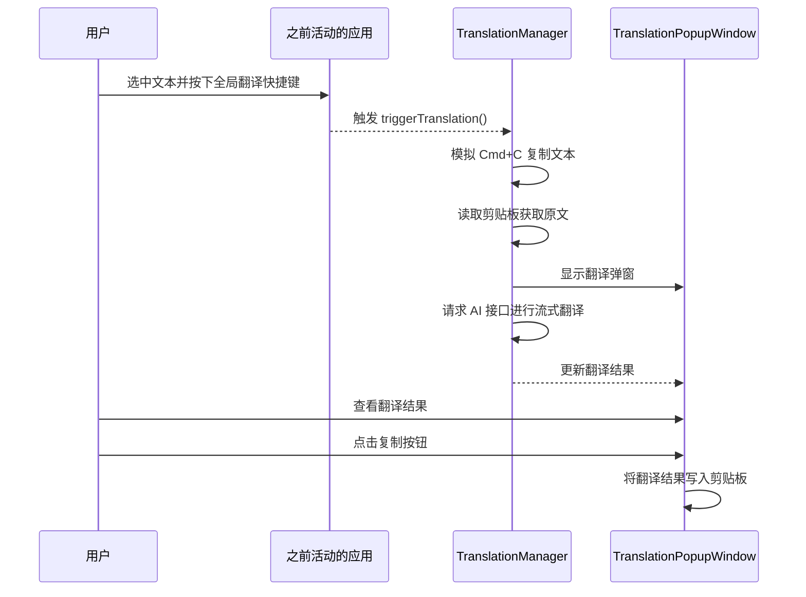
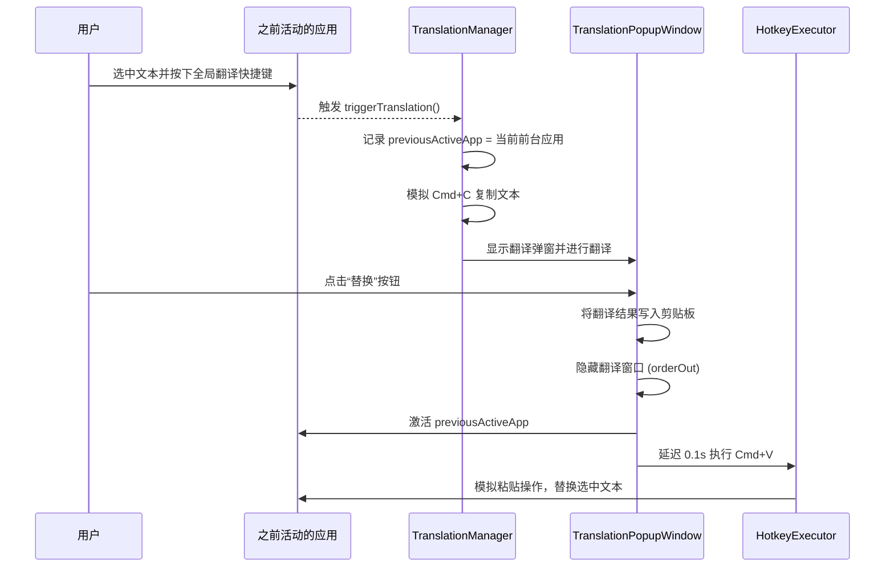

# 翻译窗口添加替换按钮

## 概述
给翻译窗口的翻译区域的复制按钮旁边添加一个“替换”按钮。点击该按钮后，将翻译结果复制到剪贴板，隐藏翻译窗口，并自动激活之前处于活动状态的应用程序，然后模拟 `Cmd+V` 快捷键，将翻译结果直接替换掉原文（如果原文处于可编辑状态且被选中）。

## 当前实现

## 测试用例
1. 打开任意文本编辑器（如备忘录、VS Code 等）。
2. 输入一段英文文本，例如 "Hello world"。
3. 选中 "Hello world"，按下全局翻译快捷键（默认是 `Cmd+3` 或其他配置的快捷键）。
4. 翻译窗口弹出，显示翻译结果 "你好，世界"。
5. 点击翻译结果区域右下角的“替换”按钮（图标为 `arrow.triangle.2.circlepath`）。
6. 预期结果：翻译窗口自动隐藏，焦点回到之前的文本编辑器，且选中的 "Hello world" 被自动替换为 "你好，世界"。

## 方案
### 方案 1：🚀 推荐方案：记录前台应用并模拟粘贴
在 `TranslationManager` 中增加一个属性 `previousActiveApp`，用于在触发翻译时记录当前处于前台的应用程序。在翻译窗口中添加“替换”按钮，点击时将翻译结果写入剪贴板，隐藏翻译窗口，激活 `previousActiveApp`，并延迟 0.1 秒后通过 `HotkeyExecutor` 模拟 `Cmd+V` 按键事件。

**优点：**
- 能够准确地将焦点还给触发翻译时的应用程序。
- 模拟 `Cmd+V` 是一种通用且可靠的文本替换方式，适用于绝大多数支持文本编辑的应用程序。
- 实现简单，复用了现有的 `HotkeyExecutor`。

**缺点：**
- 依赖于操作系统的剪贴板和快捷键模拟，极少数应用可能对模拟按键有特殊处理或延迟要求。

**代码修改位置：**
- [TranslationManager.swift](vscode://file/Volumes/Cache/X/Sources/Model/TranslationManager.swift:15)
- [TranslationManager.swift](vscode://file/Volumes/Cache/X/Sources/Model/TranslationManager.swift:25)
- [TranslationWindows.swift](vscode://file/Volumes/Cache/X/Sources/View/TranslationWindows.swift:120)

## 任务总结与结论
通过在 `TranslationManager` 中记录触发翻译时的前台应用 `previousActiveApp`，并在翻译窗口中添加“替换”按钮，实现了将翻译结果直接替换原文的功能。点击替换按钮后，程序会将翻译结果写入剪贴板，隐藏翻译窗口，激活之前记录的前台应用，并延迟 0.1 秒后模拟 `Cmd+V` 快捷键进行粘贴替换。同时，将替换按钮的图标修改为 `arrow.left.arrow.right`，避免了与刷新图标的混淆。

## 任务耗时
- 任务开始时间：09:45
- 任务结束时间：10:13
- 任务总耗时：28 分钟
