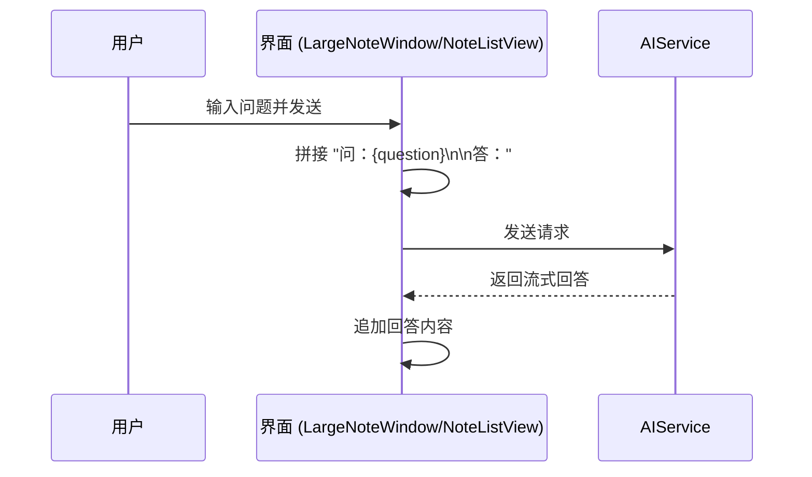
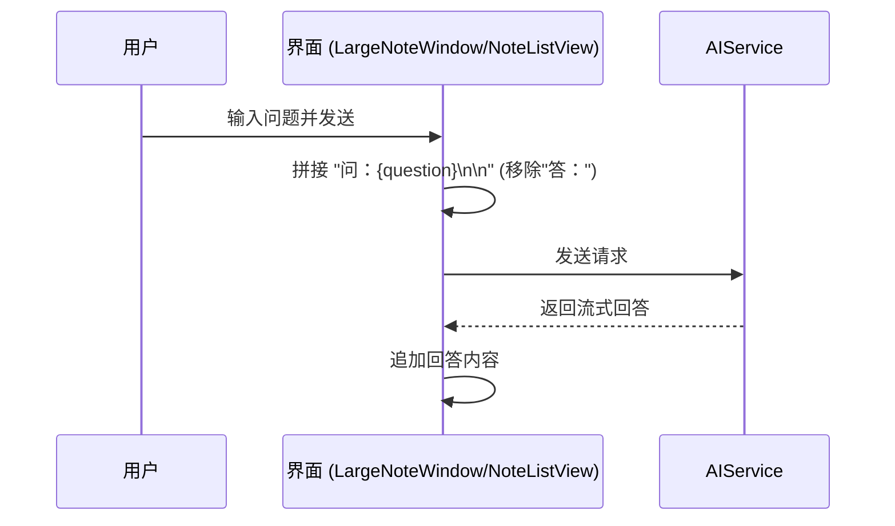

# 修改AI笔记回答格式及大窗口输入框光标颜色

## 概述
1. 移除 AI 笔记回答时自动拼接的 `答：` 前缀。
2. 将大窗口（LargeNoteWindow）中输入框的闪动光标颜色修改为白色。

## 当前实现

## 测试用例
1. 打开任意笔记，进入 AI 对话模式。
2. 输入一个问题并发送。
3. 预期结果：笔记内容中只显示 `问：{问题}\n\n`，紧接着是 AI 的回答，不再有 `答：` 前缀。
4. 打开大窗口（双击笔记或点击放大按钮）。
5. 点击底部的输入框。
6. 预期结果：输入框内的闪动光标颜色为白色。

## 方案
### 方案 1：🚀 推荐方案：修改拼接逻辑并设置 tint 颜色
在 `LargeNoteWindow.swift` 和 `NoteListView.swift` 中，修改发送消息时构建 `newContent` 的逻辑，去掉 `答：`。在 `LargeNoteWindow.swift` 的 `TextField` 中添加 `.tint(.white)` 修饰符来改变光标颜色。

**优点：**
- 直接解决了用户提出的两个问题。
- `.tint(.white)` 是 SwiftUI 中修改光标颜色的标准且简洁的方法。

**缺点：**
- 无明显缺点。

**代码修改位置：**
- [LargeNoteWindow.swift](vscode://file/Volumes/Cache/X/Sources/View/LargeNoteWindow.swift:352)
- [NoteListView.swift](vscode://file/Volumes/Cache/X/Sources/View/NoteListView.swift:443)
- [LargeNoteWindow.swift](vscode://file/Volumes/Cache/X/Sources/View/LargeNoteWindow.swift:245)

## 任务总结与结论
<待代码修改完毕后填充>

## 任务耗时
- 任务开始时间：17:25
- 任务结束时间：<待填充>
- 任务总耗时：<待填充>
