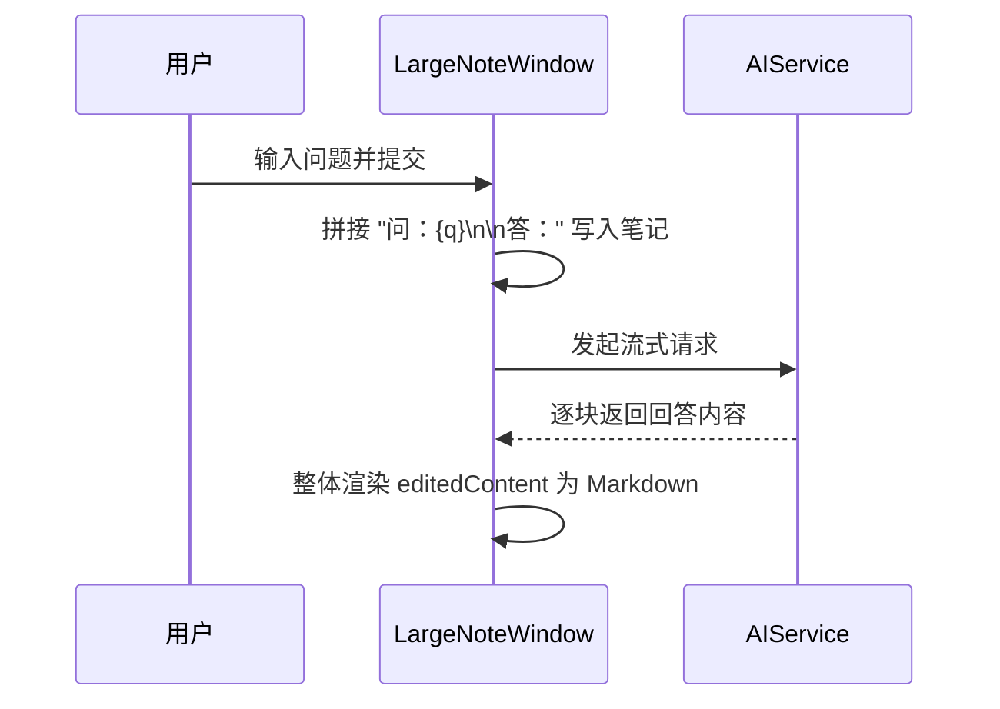
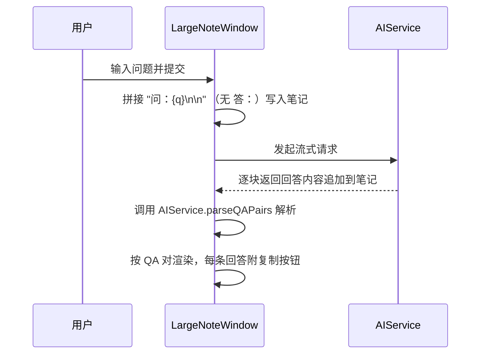

# 修改AI笔记格式及添加回复复制功能

## 概述
三项改动：
1. 移除 AI 笔记回答时自动拼接的 `答：` 前缀。
2. 将大窗口输入框的闪动光标颜色修改为白色（`.tint(.white)`）。
3. 大窗口中每条 AI 回答旁添加复制按钮，可将该条回答的 Markdown 源文本复制到剪贴板。

## 当前实现

## 测试用例
1. 打开任意 AI 笔记大窗口，输入问题发送，确认笔记内容不出现 `答：` 前缀。
2. 点击输入框，确认光标为白色。
3. 等待 AI 回答完成，确认每条回答右侧出现复制图标；点击后可粘贴出 Markdown 源文本。
4. 发多轮问答，确认每轮回答均有各自的复制按钮。

## 方案
### 🚀 推荐方案
- `AIService` 新增 `parseQAPairs` 静态方法，从笔记内容解析 `(问题, 答案)` 数组，同时兼容旧格式 `\n答：` 分隔符。
- `parseMessagesFromContent` 同步更新以兼容新格式。
- `LargeNoteWindow.aiConversationView` 改为按 QA 对逐条渲染；对已完成的回答显示复制按钮（流式输出中的最后一条不显示，完成后才显示）。
- `LargeNoteWindow` 输入框加 `.tint(.white)` 修改光标颜色。

**代码修改位置：**
- [AIService.swift](vscode://file/Volumes/Cache/X/Sources/Model/AIService.swift:64)
- [LargeNoteWindow.swift](vscode://file/Volumes/Cache/X/Sources/View/LargeNoteWindow.swift:198)
- [LargeNoteWindow.swift](vscode://file/Volumes/Cache/X/Sources/View/LargeNoteWindow.swift:246)
- [NoteListView.swift](vscode://file/Volumes/Cache/X/Sources/View/NoteListView.swift:443)

## 任务总结与结论
<待代码修改完毕后填充>

## 任务耗时
- 任务开始时间：17:33
- 任务结束时间：<待填充>
- 任务总耗时：<待填充>
