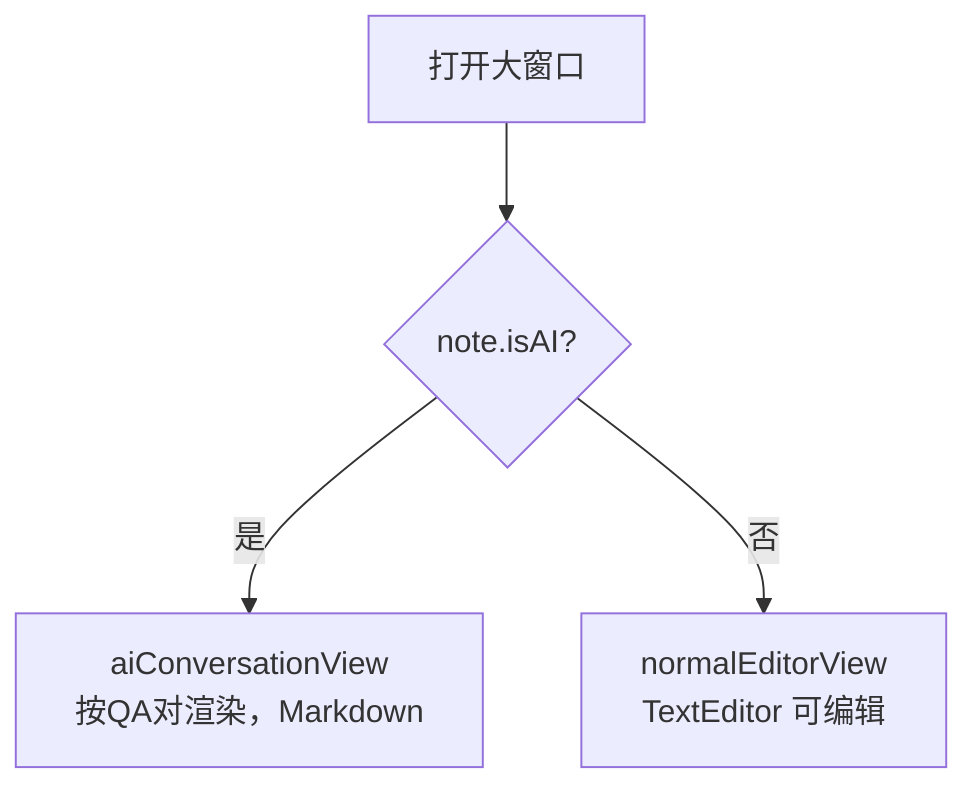
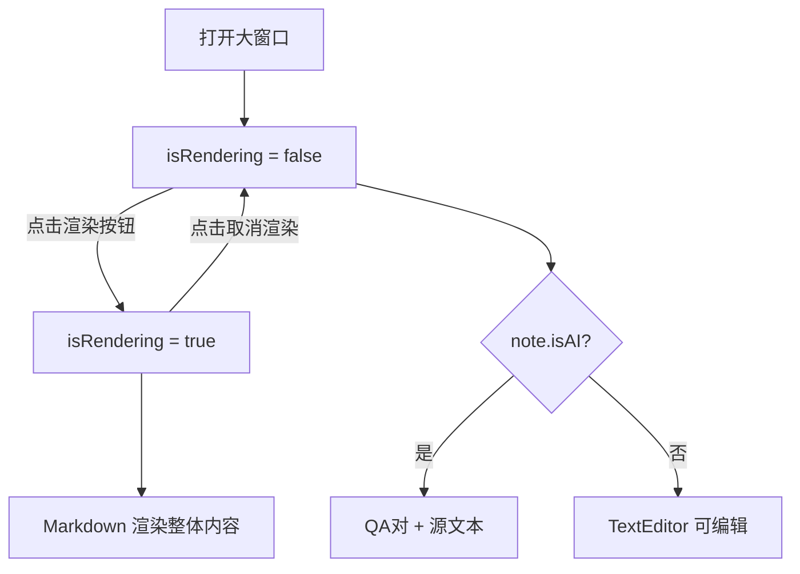
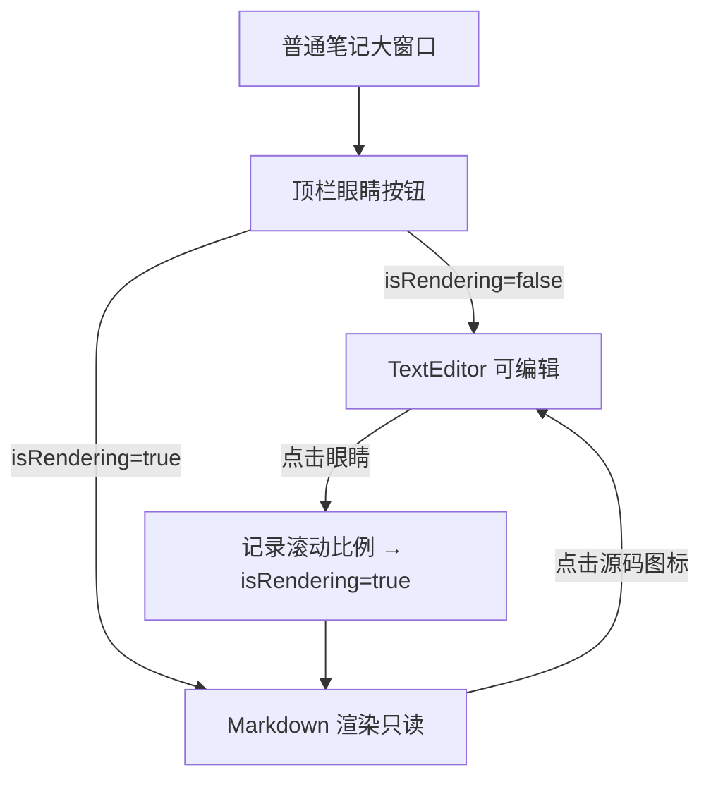

# 大窗口统一支持Markdown渲染切换

## 概述
为 AI 笔记大窗口和普通笔记大窗口统一添加 Markdown 渲染切换功能：在顶栏添加一个渲染切换按钮，点击后在"源码/编辑模式"与"Markdown 渲染模式"之间切换。AI 大窗口的每条回复原先渲染逻辑保持不变，但要修复目前渲染失效的问题。

## 当前实现

## 测试用例
1. 打开 AI 笔记大窗口，顶栏应出现渲染切换按钮（如：眼睛图标）。
2. 默认处于编辑/源码模式。
3. 点击按钮切换到渲染模式，内容按 Markdown 格式渲染。
4. 再次点击切换回编辑/源码模式。
5. 打开普通笔记大窗口，同样顶栏出现渲染按钮，功能一致。
6. AI 笔记流式输出期间禁止切换到渲染模式（或渲染模式下流式输出改为纯文本）。

## 方案
### 🚀 推荐方案：统一的 isRendering 状态切换
在 `LargeNoteView` 添加 `@State private var isRendering: Bool`，初始值由 `note.isAI` 决定（AI 笔记默认 `true`，普通笔记默认 `false`），顶栏添加切换按钮。
- **普通笔记**：`isRendering = false`（默认）时显示 `TextEditor` 可编辑；`true` 时显示 `Markdown(editedContent)` 只读渲染。
- **AI 笔记**：`isRendering = true`（默认）时按原 QA 对 Markdown 渲染；`false` 时显示纯文本源码模式（TextEditor 或 Text，不可编辑）。

**优点：**
- 改动集中在 `LargeNoteWindow.swift` 一个文件。
- 切换逻辑直接用 `if isRendering {} else {}` 区分，简洁。

**缺点：**
- 渲染模式下编辑功能不可用（可接受，用户可随时切换回来）。

**代码修改位置：**
- [LargeNoteWindow.swift](vscode://file/Volumes/Cache/X/Sources/View/LargeNoteWindow.swift:99)（添加 isRendering 状态）
- [LargeNoteWindow.swift](vscode://file/Volumes/Cache/X/Sources/View/LargeNoteWindow.swift:111)（顶栏添加切换按钮）
- [LargeNoteWindow.swift](vscode://file/Volumes/Cache/X/Sources/View/LargeNoteWindow.swift:338)（normalEditorView 添加渲染分支）
- [LargeNoteWindow.swift](vscode://file/Volumes/Cache/X/Sources/View/LargeNoteWindow.swift:198)（aiConversationView 添加渲染分支）

## 任务总结与结论

最终实现与原方案有所调整：

1. **AI 笔记大窗口**不添加渲染切换按钮（按用户要求简化），始终按 QA 对渲染，每轮右上角有复制按钮。
2. **普通笔记大窗口**顶栏添加眼睛图标切换按钮，默认编辑模式（`isRendering = false`），点击切换到 Markdown 渲染只读模式。
3. 切换到渲染模式前保存 `NSScrollView` 滚动比例，渲染视图 `onAppear` 后延迟 50ms 恢复滚动位置（近似保持）。

**修改文件**：
- [LargeNoteWindow.swift](vscode://file/Volumes/Cache/X/Sources/View/LargeNoteWindow.swift:99)

## 任务耗时
- 任务开始时间：18:10
- 任务结束时间：19:19
- 任务总耗时：69 分钟
