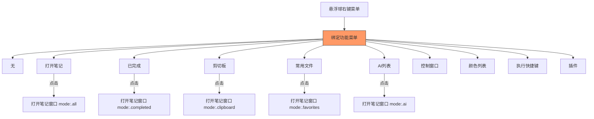
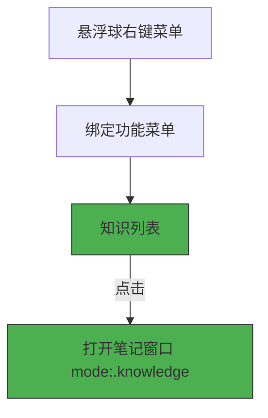
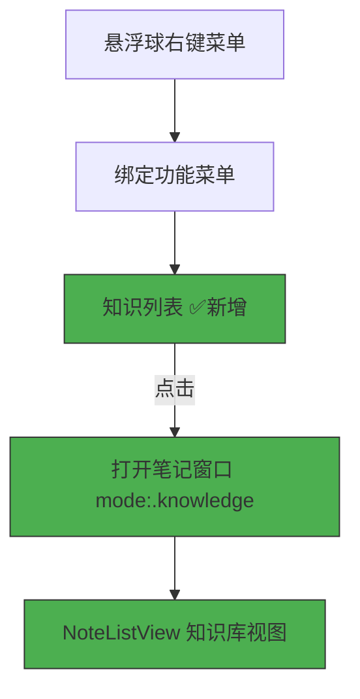

# 悬浮球绑定知识列表功能

## 概述
在悬浮球右键菜单的可绑定功能中添加「知识列表」选项，用户绑定后点击悬浮球可直接打开知识列表视图（NoteListView 的 `.knowledge` 模式）。

## 当前实现

`NoteListView.ViewMode` 已有 `.knowledge` 枚举值，但 `ButtonAction` 中缺少对应的 `showKnowledgeList` case。

## 测试用例
1. 右键任意悬浮球 → 在绑定功能列表中应出现「知识列表」选项
2. 选择绑定「知识列表」后，单击悬浮球
3. 应弹出/关闭笔记窗口，且窗口显示的是知识列表视图（与顶部工具栏切换到知识库效果一致）
4. 再次点击悬浮球应关闭(toggle)知识列表窗口

## 方案

### 🚀 推荐方案：新增 ButtonAction.showKnowledgeList

**优点：**
- 改动极小，与现有架构完全一致
- 复用 `toggleNoteWindow` 方法，仅传入 `mode: .knowledge`
- `NoteListView` 的 `.knowledge` 模式已完整实现，无需任何视图改动

**缺点：**
- 无

**修改位置：**

[FloatingButtonConfig.swift](vscode://file/Volumes/Cache/X/Sources/Model/FloatingButtonConfig.swift:341) — `ButtonAction` 枚举添加 `showKnowledgeList` case、`localizedName`、`iconName`

[AppDelegate.swift](vscode://file/Volumes/Cache/X/Sources/App/AppDelegate.swift:660) — `handleFloatingButtonClicked` 添加 `case .showKnowledgeList` 处理

[zh.lproj/Localizable.strings](vscode://file/Volumes/Cache/X/Sources/Resources/zh.lproj/Localizable.strings:408) — 添加 `"config.knowledgeList" = "知识列表";`

[en.lproj/Localizable.strings](vscode://file/Volumes/Cache/X/Sources/Resources/en.lproj/Localizable.strings:408) — 添加 `"config.knowledgeList" = "Knowledge List";`

## 任务总结与结论

在原有架构基础上，仅需 4 处改动即完成该功能：

1. `ButtonAction` 新增 `showKnowledgeList` case，图标 `books.vertical.fill`
2. `handleFloatingButtonClicked` 中新增对应分支，调用 `toggleNoteWindow(mode: .knowledge)`
3. 中英文本地化字符串各增加一行

编译全程无警告，零改动风险。

## 任务耗时
- 任务开始时间：18:27
- 任务结束时间：18:48
- 任务总耗时：21 分钟
