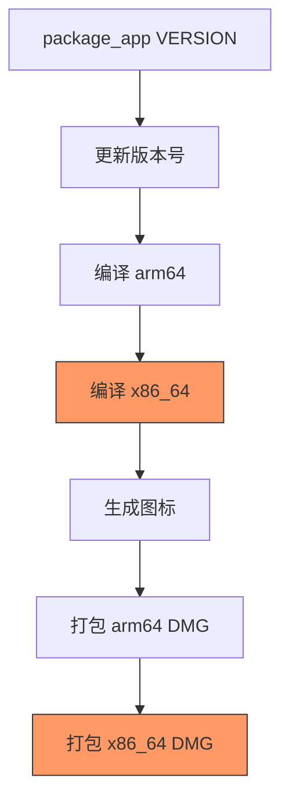
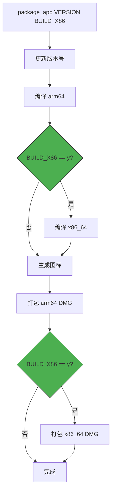
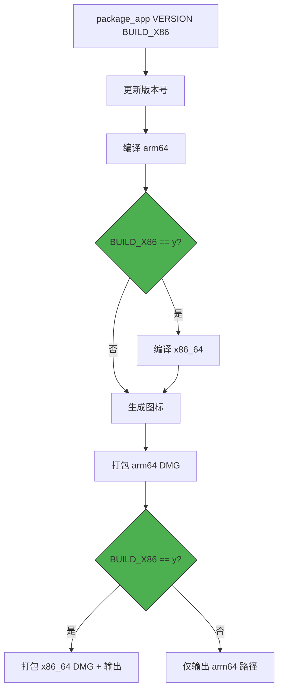

# package 命令默认不编译 x86 版本

## 概述
修改 `manage_app.sh` 的 `package` 命令：默认只编译 arm64 版本；当用户在版本号后加空格输入 `y` 时，才同时编译 x86_64 版本。

## 当前实现

当前无论是否需要 x86 版本，都会强制编译并打包 x86_64，耗费额外时间。

## 测试用例
1. `./manage_app.sh package` → 仅编译 arm64，自动递增版本，只生成 arm64 DMG
2. `./manage_app.sh package 1.0.1` → 仅编译 arm64，指定版本 1.0.1，只生成 arm64 DMG
3. `./manage_app.sh package 1.0.1 y` → 同时编译 arm64 + x86_64，指定版本，生成两个 DMG
4. `./manage_app.sh p 1.0.1 y` → 快捷方式，同上

## 方案

### 🚀 推荐方案：新增 `BUILD_X86` 参数

**新语法：**
- `./manage_app.sh package [版本号] [y]`
- 第二个参数为版本号（可选），第三个参数为 `y` 表示同时编译 x86

**优点：**
- 改动集中，逻辑清晰
- 默认快速构建（只 arm64），按需扩展到双架构
- 向后兼容现有用法

**缺点：**
- 无

**修改位置：**

[manage_app.sh](vscode://file/Volumes/Cache/X/manage_app.sh:423) — `package_app` 函数主体，添加 `build_x86` 参数判断

[manage_app.sh](vscode://file/Volumes/Cache/X/manage_app.sh:533) — 主逻辑 case 中传递 `$3` 参数

[manage_app.sh](vscode://file/Volumes/Cache/X/manage_app.sh:499) — `show_help` 中更新帮助文本

## 任务总结与结论

仅修改 `manage_app.sh`：`package_app` 函数新增 `build_x86` 第二参数，主逻辑透传 `$3`，帮助文本同步更新。

## 任务耗时
- 任务开始时间：18:50
- 任务结束时间：18:58
- 任务总耗时：8 分钟
