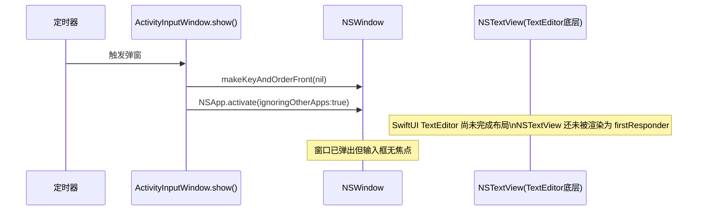
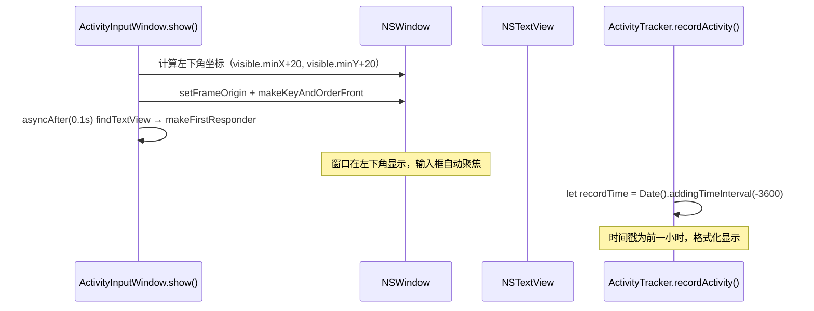
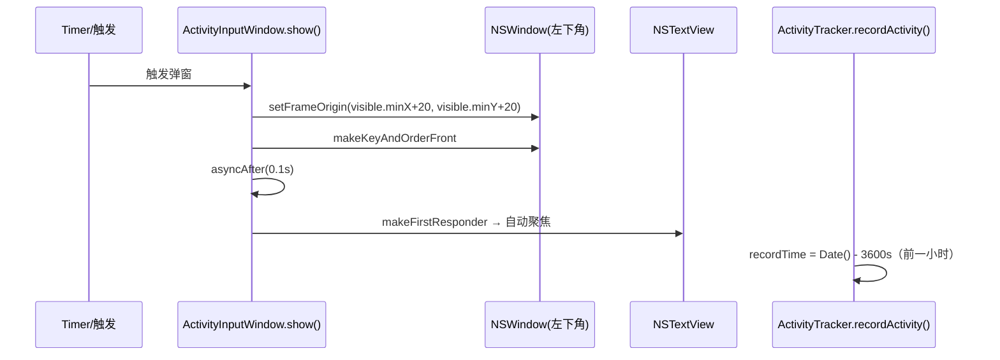

# 活动记录窗口输入聚焦修复

## 概述
活动记录弹窗（输入"这一小时你做了什么？"）存在以下三个问题：
1. 打开后 TextEditor 无法直接输入，需要手动点击才能聚焦
2. 弹窗应显示在屏幕**左下角**（参考复习提示的右下角实现）
3. 记录时的时间戳应为**前一个小时**，而非点击"记录"时的当前时间

## 当前实现

**问题根因**：`makeKeyAndOrderFront` 执行时，SwiftUI 的 `TextEditor` 尚未完成内部 `NSTextView` 的创建，窗口虽然是 keyWindow，但没有 firstResponder 指向 NSTextView。

## 测试用例
1. 等待活动记录计时器触发（或在设置中将间隔设短）
2. 弹窗出现后，**不点击任何位置**，直接敲键盘输入文字
3. 输入应直接进入文本框

## 🚀 推荐方案

### 方案一：综合修复（三个问题一并解决）

**代码修改位置：**
- [ActivityInputWindow.swift](vscode://file/Volumes/Cache/X/Sources/View/ActivityInputWindow.swift:154) — 窗口定位改为左下角
- [ActivityTracker.swift](vscode://file/Volumes/Cache/X/Sources/Model/ActivityTracker.swift:97) — 时间戳改为 Date().addingTimeInterval(-3600)

## 任务总结与结论

三处修改全部完成：
1. [ActivityInputWindow.swift](vscode://file/Volumes/Cache/X/Sources/View/ActivityInputWindow.swift:153) — 窗口定位改为左下角 + 延迟 100ms 设置 NSTextView 为 firstResponder
2. [ActivityTracker.swift](vscode://file/Volumes/Cache/X/Sources/Model/ActivityTracker.swift:97) — 时间戳改为 `Date().addingTimeInterval(-3600)`
3. placeholder 对齐：改用 ZStack 嵌套，padding.top=2 与 NSTextView 光标起点对齐

## 任务耗时
- 任务开始时间：20:07
- 任务结束时间：20:44
- 任务总耗时：37 分钟
