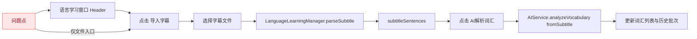
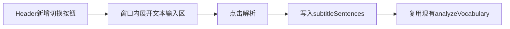
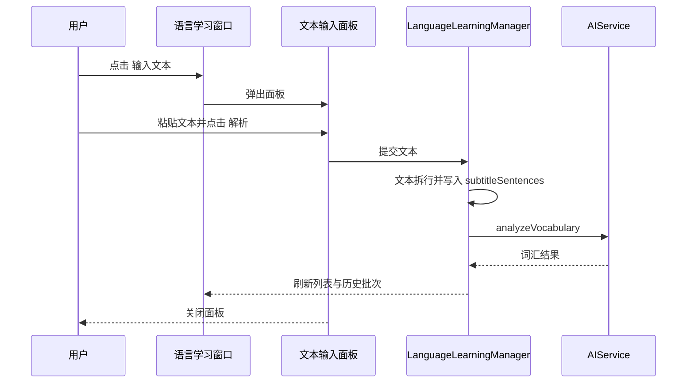
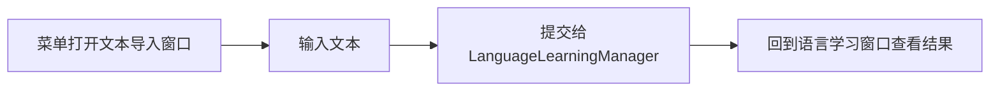
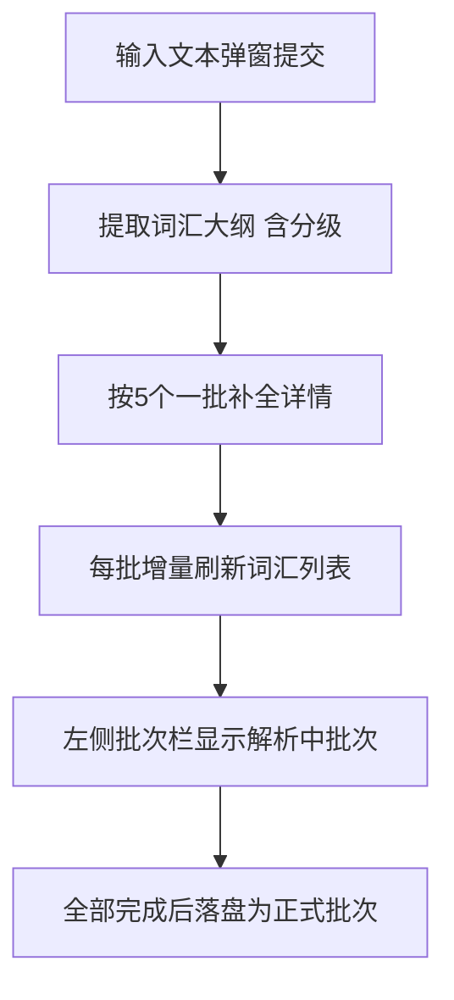

# 语言学习输入文本解析词汇

## 概述
当前语言学习窗口仅支持“导入字幕”后触发 AI 词汇解析。本任务新增“输入文本”入口：用户点击按钮后弹出文本输入面板，粘贴任意文本并点击“解析”，即可复用现有 AI 词汇解析流程产出词汇批次。

## 当前实现

## 测试用例
1. 打开语言学习窗口，点击“输入文本”，粘贴 3~5 句英文文本，点击“解析”，应出现词汇结果并新增历史批次。
2. 在输入面板中粘贴仅空白字符，点击“解析”，应提示无有效文本，不应触发解析。
3. 在已有字幕导入后，再通过“输入文本”解析，结果应按新批次保存，不影响旧批次切换。
4. 解析进行中再次点击“输入文本”或“AI解析词汇”，应遵循现有 `isAnalyzing` 状态约束，避免并发冲突。
5. 关闭并重开窗口，历史批次应仍可从下拉菜单选择（验证持久化逻辑未受影响）。

## 方案
### 方案一：在主窗口内嵌多行输入区（不弹窗）

优点：
- 交互路径短，一屏完成输入与解析。

缺点：
- 改动主布局较大，挤占词汇区域空间。
- 不符合“点击按钮后弹出文本输入面板”的需求描述。

代码修改位置：
- [LanguageLearningWindow.swift](vscode://file/Volumes/Cache/X/Sources/View/LanguageLearningWindow.swift:17)
- [LanguageLearningWindow.swift](vscode://file/Volumes/Cache/X/Sources/View/LanguageLearningWindow.swift:50)

### 推荐🚀方案二：新增“输入文本”弹窗面板（主窗口保持轻量）

优点：
- 完全符合“弹出文本输入面板”的交互要求。
- 对现有主界面侵入小，风险低，复用既有解析和批次存储逻辑。
- 后续可在面板中扩展预处理（去噪、语言检测）而不影响主界面。

缺点：
- 需要新增一个小型弹窗视图状态管理。
- 需补充输入有效性校验和错误提示文案。

代码修改位置：
- [LanguageLearningWindow.swift](vscode://file/Volumes/Cache/X/Sources/View/LanguageLearningWindow.swift:50)
- [LanguageLearningWindow.swift](vscode://file/Volumes/Cache/X/Sources/View/LanguageLearningWindow.swift:62)
- [LanguageLearningManager.swift](vscode://file/Volumes/Cache/X/Sources/Model/LanguageLearningManager.swift:123)
- [LanguageLearningManager.swift](vscode://file/Volumes/Cache/X/Sources/Model/LanguageLearningManager.swift:291)
- [AIService+Memory.swift](vscode://file/Volumes/Cache/X/Sources/Model/AIService+Memory.swift:22)

### 方案三：新增独立“文本导入”窗口（与语言学习窗口并列）

优点：
- 结构清晰，职责分离明确。

缺点：
- 新窗口管理成本更高，用户来回切换成本高。
- 明显超出本次需求最小改动范围。

代码修改位置：
- [AppDelegate.swift](vscode://file/Volumes/Cache/X/Sources/App/AppDelegate.swift:1)
- [LanguageLearningWindow.swift](vscode://file/Volumes/Cache/X/Sources/View/LanguageLearningWindow.swift:1)

## 任务总结与结论
已按推荐方案完成，并结合联调反馈做了三轮增强：
1. 新增“输入文本”入口与弹出输入面板，支持粘贴文本后一键解析。
2. 修复长文本场景下 AI 返回不稳定问题，加入解析链路日志与返回规范化容错。
3. 解析流程升级为“两阶段分批处理”：先提取词汇大纲，再按每批5个补全详情并增量显示到界面。
4. 词汇页改为三栏布局（左批次/中单词/右详情），并在解析中显示临时批次选项，确保增量过程可见可选。

## 任务耗时
- 任务开始时间：11:31
- 任务结束时间：12:27
- 任务总耗时：56 分钟
