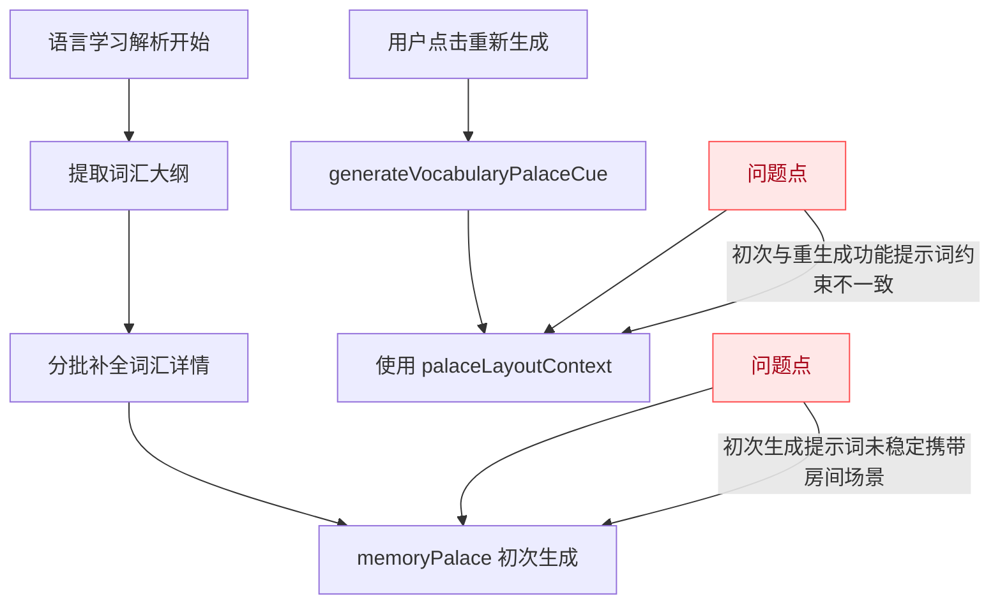
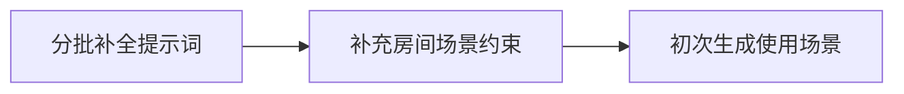
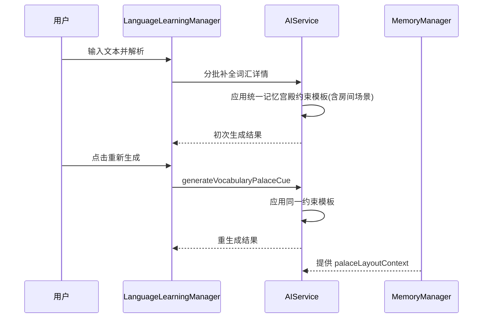
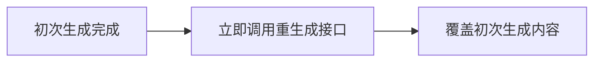
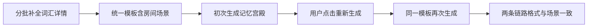

# 记忆宫殿房间场景一致性修复

## 概述
当前语言学习词汇的“初次生成记忆宫殿助记”未稳定使用用户在偏好中设置的房间场景；同时，用户期望“重新生成”与“初次生成”在内容结构和风格上保持一致。本任务目标是统一两条生成链路，保证都基于同一场景约束与同一输出规范。

## 当前实现

## 测试用例
1. 在偏好设置中填写明确房间场景（例如：书桌、衣柜、床头等锚点），输入文本解析词汇，检查初次生成的“记忆宫殿助记”是否明显引用这些锚点。
2. 对同一词汇点击“重新生成”，检查结果是否沿用同一房间场景约束，并与初次生成保持同类结构（拼写/发音/含义三维度一致）。
3. 连续处理多批词汇，确保每批次初次生成都遵守房间场景，不出现“通用模板化且脱离房间布局”的内容。
4. 清空房间场景后再次测试，初次与重新生成都应退化为无场景版本，但二者格式仍应一致。

## 方案
### 方案一：仅修补初次生成提示词（最小改动）

优点：
- 变更范围小，风险低。

缺点：
- 仅解决“是否使用场景”，不能彻底保证初次与重生成功能格式一致。
- 后续提示词演进仍可能再次分叉。

代码修改位置：
- [AIService+Memory.swift](vscode://file/Volumes/Cache/X/Sources/Model/AIService+Memory.swift:66)

### 推荐🚀方案二：抽取统一“词汇记忆宫殿约束模板”，初次与重生共用

优点：
- 从根上统一两条链路，确保场景约束与格式一致。
- 后续仅维护一套模板，减少回归风险。
- 更容易扩展到其他记忆宫殿相关能力。

缺点：
- 需要对提示词构建进行小幅重构。

代码修改位置：
- [AIService+Memory.swift](vscode://file/Volumes/Cache/X/Sources/Model/AIService+Memory.swift:66)
- [AIService+Memory.swift](vscode://file/Volumes/Cache/X/Sources/Model/AIService+Memory.swift:184)
- [LanguageLearningManager.swift](vscode://file/Volumes/Cache/X/Sources/Model/LanguageLearningManager.swift:226)
- [MemoryManager.swift](vscode://file/Volumes/Cache/X/Sources/Model/MemoryManager.swift:22)

### 方案三：初次生成后强制再走一次“重新生成”接口

优点：
- 能快速复用已有重生成路径。

缺点：
- 增加一次额外请求，时延与成本更高。
- 逻辑重复，不利于长期维护。

代码修改位置：
- [LanguageLearningManager.swift](vscode://file/Volumes/Cache/X/Sources/Model/LanguageLearningManager.swift:195)
- [AIService+Memory.swift](vscode://file/Volumes/Cache/X/Sources/Model/AIService+Memory.swift:184)

## 任务总结与结论
已完成并通过测试。核心结果如下：
1. 初次生成链路已接入用户房间场景上下文，记忆宫殿内容可稳定引用偏好中的场景锚点。
2. 初次生成与“重新生成”共用同一套词汇记忆宫殿约束模板，结构保持一致（拼写/发音/含义三维度）。
3. 分批词汇补全过程已携带统一约束，避免出现初次与重生成风格分叉。

## 任务耗时
- 任务开始时间：12:30
- 任务结束时间：13:01
- 任务总耗时：31 分钟
