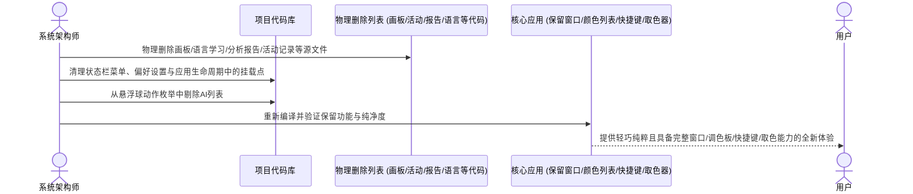

# 精简悬浮球与多余功能

## 概述

随着项目功能的演进，为了让应用保持高度聚焦、极致精炼，我们需要进行一次彻底的代码与架构级瘦身。本次重构的目标不仅仅是隐藏功能入口或停止后台运行，而是将无用的功能模块及其关联的源代码、视图、管理器及配置物理移除，实现真正意义上的代码减负。

本次调整的核心边界与执行准则如下：
1. **彻底删除功能源码与架构模块**：
   - 彻底删除「画板」相关的所有源码文件（画板数据中心、画板视图与窗口）。
   - 彻底删除「翻译历史」相关的所有窗口与视图代码。
   - 彻底删除「记忆总览」对应的独立窗口展示代码。
   - 彻底删除「语言学习」相关的所有源码文件（语言学习管理服务与窗口界面）。
   - 彻底删除「分析报告」相关的所有源码文件（报告生成服务与分析报告窗口）。
   - 彻底删除「记录活动」相关的所有源码文件（活动追踪器、活动配置模型、整点活动输入窗口）。
   - 彻底删除悬浮球右键动作定义中的「AI列表」枚举与对应分支代码。
2. **完整保留生产力工具链与代码**：
   - 完整保留悬浮球「控制窗口」、「颜色列表」、「执行快捷键」的一切能力与数据结构。
   - 完整保留屏幕「取色器」管理服务、取色器全局快捷键注册及偏好设置中的快捷键配置项。
3. **全面清理关联依赖与设置区块**：
   - 清理状态栏主菜单、偏好设置页面中对已删除模块的全部依赖引用与设置行。
   - 确保清理后整个工程结构纯净，无任何残留悬空引用，编译一次性顺利通过。

## 测试用例

1. **悬浮球右键绑定菜单测试**：
   - 启动应用后，在桌面悬浮球上单击鼠标右键展开操作绑定列表。
   - 检查并确认保留项：「控制窗口」、「颜色列表」、「执行快捷键」均完好存在且支持绑定。
   - 检查并确认移除项：列表中不再显示「AI列表」选项。
   - 分别测试绑定「控制窗口」、「颜色列表」、「执行快捷键」后的点击交互：
     - 点击绑定了「控制窗口」的悬浮球，可正常切换目标窗口的显隐。
     - 点击绑定了「颜色列表」的悬浮球，可在悬浮球旁弹出色板。
     - 点击绑定了「执行快捷键」的悬浮球，可正常模拟快捷键触发。

2. **状态栏全局菜单与取色器测试**：
   - 单击 macOS 顶部状态栏图标展开主菜单。
   - 确认「取色器」菜单项正常保留，点击可正常启动屏幕吸色，使用取色器全局快捷键也能正常启动屏幕吸色。
   - 确认菜单列表中已完全移除以下 6 项功能入口：
     - 「画板」
     - 「翻译历史」
     - 「记忆总览」
     - 「语言学习」
     - 「分析报告」
     - 「记录活动」
   - 确认保留的全局菜单项（如显示/隐藏全部、添加悬浮球、整理悬浮球、使用说明、偏好设置、退出应用等）排版美观且点击正常。

3. **偏好设置与工程纯净度测试**：
   - 从状态栏菜单打开「偏好设置」窗口。
   - 在通用快捷键设置中，确认「取色器全局快捷键」正常展示且支持用户自定义修改与快捷键重置。
   - 检查偏好设置中已彻底移除语言学习、活动记录追踪与分析报告的所有设置区块。
   - 编译与代码检查：执行编译命令，验证上述已删除模块的代码文件已被安全物理清理，工程无任何编译错误或隐式遗留。

## 方案

### 推荐方案：彻底删除功能代码与物理清理冗余文件

我们推荐采用「源码级彻底删除、工程级干净解耦」的清理方案：
在文件层面，直接物理删除画板、语言学习、分析报告、活动追踪等模块对应的源码文件；在公共主干层（如状态栏菜单构建、偏好设置主视图、应用生命周期委托），直接剔除对已删除模块的实例化、定时器注册与界面呈现；在悬浮球核心枚举中移除AI列表动作，其余生产力动作（控制窗口、颜色列表、执行快捷键、取色器）全部完整保留并严格校验。

- **优点**：
  - 清理极为干净彻底：直接从工程中移除废弃的源码文件与依赖，不留任何沉余代码或死亡代码。
  - 项目体积与复杂度显著下降：编译速度提升，工程文件树大幅简化，大幅降低后续维护负担。
  - 核心体验零受损：高频使用的窗口控制、颜色列表、执行快捷键与屏幕取色器保持原有完整功能。
- **缺点**：
  - 需要非常仔细地梳理被删除文件在整个项目中的全部引用关系，逐一安全解耦，确保编译零报错。

