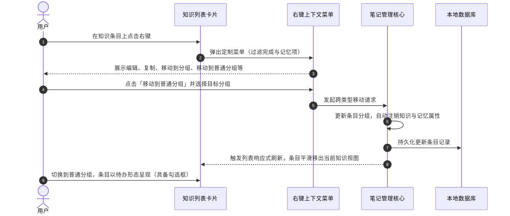

# 知识分组列表项右键菜单与完成状态调整

## 概述
您好！在当前的笔记与知识管理系统中，普通笔记通常承担着“待办事务与临时记录”的职能，而知识库中的条目则侧重于“知识积累、参考与长期沉淀”。

为了让产品理念更符合直觉并提升交互体验，本次调整主要解决两个维度的诉求：
一是**界面语义纯净化**：知识条目不是待办任务，因此知识分组中的卡片不再展示左侧的完成勾选框，右键菜单中也相应移除“已完成”与冗余的“标记为记忆”选项，呈现纯粹的知识卡片形态。
二是**分组流转对称化**：过去普通笔记可以灵活“保存为知识”，而知识条目仅有一个单向的移出按钮；本次将为知识列表项补全“移动到普通分组”的右键选项，让条目能够在普通分组与知识库分组之间自由、无缝地双向流转。

---

## 测试用例

### 测试用例一：知识列表项视觉呈现（去除左侧勾选框）
1. 启动应用并进入侧边栏，切换到任意知识库分组（如默认的“智库”或自建知识分组）。
2. 观察知识条目卡片：
   - 确认卡片左侧不再出现方框复选框图标，卡片内容向左对齐，布局紧凑自然。
   - 悬停在卡片上，右侧浮动操作按钮（移动分组、复制、删除）以及悬停高度依然平稳正常。
3. 切换回普通笔记分组（如“闪念”）：
   - 确认普通待办笔记左侧依然正常显示复选框，可正常打勾完成。

### 测试用例二：知识列表项右键菜单验证
1. 在知识库条目卡片上点击鼠标右键，唤起上下文菜单。
2. 检查右键菜单的内容项：
   - **完成相关**：确认不再存在“标记为已完成 / 标记为未完成”菜单项。
   - **记忆相关**：确认不再存在“标记为记忆 / 取消记忆标记”菜单项。
   - **移动分组**：确认保留原有的“移动到分组”（在知识库分组间移动），并新增“移动到普通分组”级联子菜单，展开后列出所有普通分组名称。
   - **其他通用项**：放大窗口编辑、复制内容、置顶、删除等通用操作均保留且工作正常。

### 测试用例三：跨类型移动分组功能验证
1. 在知识库条目卡片上右键，展开“移动到普通分组”，选择目标普通分组（例如“闪念”）。
2. 切换回目标普通分组，验证该条目：
   - 已经成功转移到该分组中。
   - 重新具备左侧完成勾选框。
   - 右键菜单恢复为普通笔记的菜单体系（拥有标记完成、保存为知识等选项）。
3. 验证原知识条目若曾关联外部记忆标记，在迁出至普通分组后已自动解绑记忆关联。

---

## 方案

### 推荐方案思路
推荐采用“视图层条件精准渲染 + 数据层自动状态对齐”的协同方案：
1. **视图层渲染区分**：
   - 在卡片组件中，根据条目的知识属性进行轻量分支判断：当条目属于知识项时，不构建左侧复选框控件，使文本占据主要视觉区域。
   - 在卡片的右键上下文菜单中，针对知识项隐藏完成状态切换按钮与记忆标记切换按钮，同时构建“移动到普通分组”的二级级联菜单，清晰列出所有非知识库分组供用户选取。
2. **数据层自适应归一**：
   - 优化条目移动的核心逻辑。无论条目是从知识分组迁入普通分组，还是从普通分组迁入知识库分组，底层根据目标分组的性质自动同步调整知识属性与记忆绑定，保证数据在不同维度视图下的严格一致。

### 方案优缺点分析
- **优点**：
  - **交互直观清爽**：知识卡片与待办任务彻底脱钩，不再产生“知识条目被打勾完成”的语义混淆。
  - **操作体验对称**：普通笔记与知识条目在分组流转上形成完整闭环，操作习惯统一连贯。
  - **架构稳固一致**：移动分组时由底层自动维护条目性质与外部关联，杜绝脏数据残留。
- **缺点**：
  - **习惯适应**：习惯了在知识卡片上通过勾选来标记状态的少数用户，需要适应新的纯卡片知识形态。

### 交互时序图

