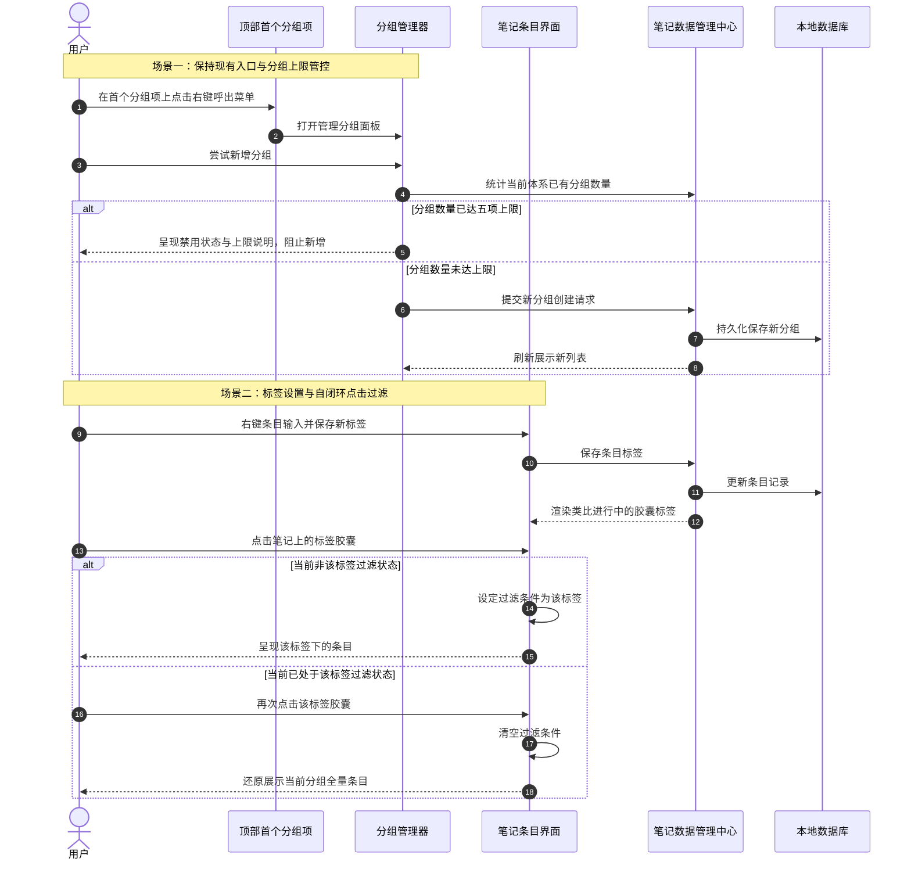

# 限制分组数量与笔记标签过滤

## 概述

亲爱的朋友，为了让您的日常记录更加聚焦、井井有条，同时避免分类臃肿与层级繁杂，我们本次将对笔记的分组体系与标签归类检索体验进行细致的优化打磨：

1. **分组数量精简收敛**：对普通笔记分组和知识笔记分组分别引入数量上限约束，包含预设分组（如普通笔记中的“闪念”、知识库中的“智库”）在内，最多支持五个分组。现有的分组管理入口（在首个分组标签上右键呼出管理面板）完全保持原样，原汁原味不受任何影响。
2. **条目标签与点击即滤**：在笔记条目上引入轻便的标签功能。标签在条目下方以类似“进行中”的精致胶囊徽章呈现；轻点某个笔记上的标签，即可按该标签快速过滤列表；再次轻点该标签，即可瞬间退出过滤恢复全量列表，极简顺手，完全不侵占额外的界面空间。

## 测试用例

完成功能改造后，您可以按照以下步骤进行完整而轻松的体验验证：

1. **进入现有分组管理入口**：
   - 打开笔记列表，在分组标签栏的第一个分组（如“闪念”或“智库”）上点击鼠标右键。
   - 检查右键菜单中的“管理分组”选项是否正常弹出原有的分组管理设置面板，原有交互保持完好。

2. **普通分组上限校验**：
   - 在分组管理中，尝试在普通分组下新建分组，直到总数达到五个（包含“闪念”分组在内）。
   - 观察当普通分组总数达到五个时，新建分组的添加按钮与输入区域是否正确呈现置灰或限制提示，无法继续新增第六个普通分组。

3. **知识分组上限校验**：
   - 在分组管理中切换到知识库分组。
   - 同样进行新建操作，验证包含“智库”在内的知识库分组总数达到五个后，是否同样被严格限制，无法继续新建。

4. **笔记添加与编辑标签**：
   - 返回笔记主列表，在任意一条笔记条目上点击右键呼出菜单。
   - 选择“添加标签”或“编辑标签”选项，在弹出的小巧输入框中输入标签名称（例如“工作”或“随笔”）并确认。
   - 观察笔记条目内容下方是否优雅地出现精致胶囊标签，其高度与间距跟原有的“进行中”胶囊风格协调一致。

5. **点击标签过滤与再次点击取消**：
   - 点击该笔记条目上的标签胶囊，观察列表是否即刻过滤出所有携带该标签的条目。
   - 再次点击任意一条已筛选笔记上的相同标签胶囊，观察列表是否立刻取消过滤，平稳恢复为当前分组下的全部笔记。

## 方案

我们推荐采用「原位入口保持 + 双端上限防御 + 标签自闭环切换」的方案，思路如下：

1. **保持现有管理入口，注入数量上限防线**：
   - 完整保留在首个分组标签上右键呼出分组管理的现有体验，绝不调整入口逻辑。
   - 在分组管理面板中，实时统计当前选定分类体系（普通笔记或知识库）的分组数量。
   - 一旦总数达到五个上限，新建分组入口即时切换为禁用态并呈现温馨的上限提示；同时在底层管理器中加入数量拦截保护，确保数据安全。

2. **笔记标签轻量持久化与向下兼容**：
   - 在本地数据库与笔记数据实体中平滑扩展标签字段，完美兼容现有历史笔记。
   - 无论是普通笔记还是知识库笔记，均无缝读取与更新条目的标签属性。

3. **视觉风格对齐的标签胶囊组件**：
   - 将标签胶囊融入条目下方的元信息横向布局中，与“记忆”或“进行中”胶囊并排安放，风格与尺寸完全类比“进行中”样式。
   - 在右键菜单中提供“设置标签”及“清除标签”便捷操作。

4. **纯粹自闭环的极简点击过滤交互**：
   - 在列表视图状态中维护当前被激活的过滤标签标识。
   - 用户点击某个笔记上的标签胶囊时：
     - 若当前未过滤或过滤的是其他标签，则激活该标签过滤；
     - 若当前已经按该标签过滤，则立即重置并清空过滤状态，瞬间还原全量列表。
   - 界面上无需在顶部或工具栏添加常驻过滤条，保持界面一贯的纯净、克制与优雅。

**优点**：
- 严格遵循原有的交互习惯，首个分组右键入口不受干扰；
- 列表空间零额外占用，点击过滤、再点还原的自闭环手感极佳；
- 分组数量受到良好管控，避免无休止堆砌；
- 标签与现有“进行中”徽章视觉语言高度融合统一。

**缺点**：
- 分组达到五项上限后若想新增，需先删除旧分组。

