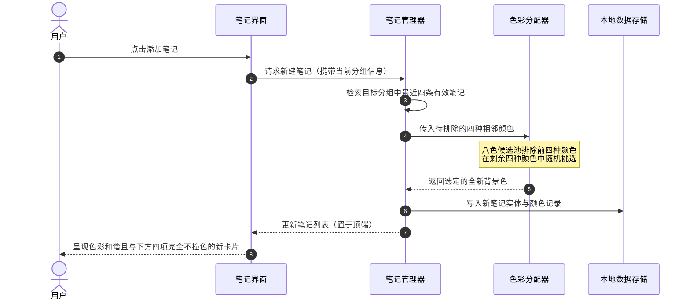

# 优化笔记项背景算法确保相邻无重色

## 概述

亲爱的朋友，在日常使用笔记功能时，丰富的色彩不仅能让界面赏心悦目，还能帮助我们快速区分不同的条目内容。以往笔记创建时的随机色彩池较小，且排重时参考了包含其他分组在内的全局序列，导致在特定分组列表中偶尔会出现相邻笔记颜色撞车、甚至多条笔记颜色完全一致的情况。

本次任务的目标，就是精心打磨笔记创建时的背景色彩选取算法。我们将调色板扩充至八种对比鲜明又彼此和谐的现代化色调，并在创建笔记时精准锁定当前分组的最近四条笔记，从中剔除已出现的颜色，确保任何连续相邻的五条笔记都拥有各不相同的独特色彩，为视觉呈现注入秩序与美感。

## 测试用例

完成调整后，你可以按照以下步骤亲手验证效果：

1. **常规连续新建验证**：
   - 打开笔记列表窗口，停留在默认的「闪念」分组中。
   - 连续快速点击五次添加新笔记按钮。
   - 观察新生成的这五条笔记卡片，核对它们的背景色彩是否互不相同，没有任何两条撞色。

2. **跨分组新建验证**：
   - 切换到「智库」知识库分组。
   - 连续新建三至五条知识笔记。
   - 观察当前「智库」分组内的笔记卡片，确认其色彩依然严格遵循相邻无重复规则，且不会受到「闪念」分组旧笔记颜色的干扰。

3. **多样性与稳定性验证**：
   - 继续在任意分组中新增第六条、第七条笔记。
   - 观察每一次新增时，新笔记与其下方紧邻的四条笔记（构成任意连续五个条目的滑动窗口）色彩均完全独立各异，整体列表色彩斑斓且分布均匀。

## 方案

### 推荐方案：八色调色盘结合目标分组上下文动态排重

**思路概述**：
我们保留用户原有的历史数据与笔记存储结构，不改变数据库中已记录的历史色彩。在全局模型层中，我们将预设色彩池扩充至八种精挑细选的高对比现代主色（紫色、绿色、蓝色、红色、橙色、粉色、青色、靛蓝）。每当用户在某个分组中创建普通笔记、空白笔记、AI 笔记或转存智库笔记时，系统首先检索该分组视图下最近排在前面的四条未删除有效笔记所使用的颜色，将它们作为禁选名单。因为总色彩池有八种颜色，即使排除了前四种，池中依然稳定保有四种可用颜色。系统再从这四种候选色中随机抽取一种赋予新笔记。这样既彻底避免了任何相邻五项内部出现重复色彩，又保留了足够的色彩随机性与视觉丰富度。

**优点**：
- **算法轻盈优雅**：无需额外重构数据库表结构或引入复杂的全量刷新逻辑，执行效率极高。
- **视觉体验提升**：八种色彩丰富多样，有效杜绝了列表单调与相邻卡片视觉粘连。
- **范围精准隔离**：严格按用户当前所属的分组与视图状态抓取相邻笔记，彻底解决了跨分组造成的上下文错位问题。
- **历史数据零风险**：不强行刷写旧数据，保证旧记录的稳定与安全。

**缺点**：
- 若用户在列表中执行置顶、取消置顶或删除中间条目等重排操作，局部可能会因为项的移位而略微改变原有相邻关系（不过在后续常规新增时依然能自动恢复规律）。

### 流程时序图

