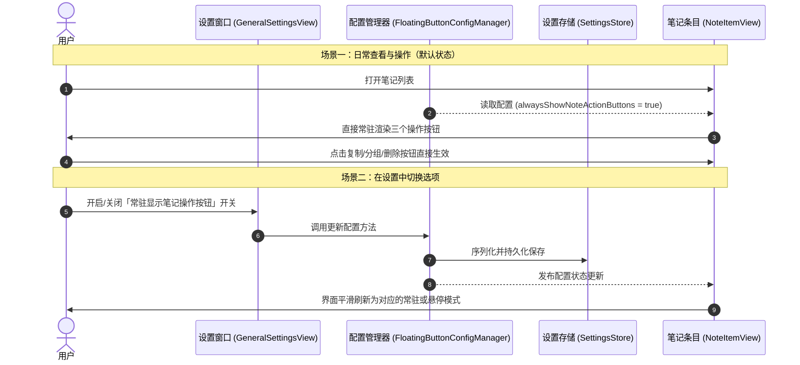

# 笔记列表操作按钮常驻显示设置

## 概述
目前在笔记列表视图中，每条普通笔记右侧的三个操作按钮（移动分组、复制内容、删除笔记）默认仅在鼠标悬停（Hover）在笔记项上时才会展示。当鼠标移出时，按钮会自动隐藏。

为了满足不同用户对于高频操作效率的需求，我们计划在「通用设置」中新增一项配置开关：允许用户选择是否将笔记项右侧的操作按钮常驻显示（默认为不隐藏/常驻显示）。这样用户无需每次特意悬停鼠标，即可直接点击进行分组移动、内容复制或删除操作，操作更加直观快捷；同时依然保留设置切换能力，偏好极简视觉风格的用户也可自由切换回悬停隐藏模式。

## 测试用例
1. **默认状态验证**：
   - 启动应用，打开笔记窗口列表；
   - 观察普通笔记条目：右侧的三个按钮（移动分组、复制、删除）默认直接常驻展示，无需鼠标悬停；
   - 点击各个按钮，验证移动分组菜单弹出、复制到剪切板、删除笔记等功能均正常可用。

2. **设置项切换验证**：
   - 打开「偏好设置」->「通用」标签页；
   - 在外观设置板块中，找到新增的配置开关「常驻显示笔记操作按钮」；
   - 观察该开关默认状态为「开启」；
   - 关闭该开关，返回笔记列表：普通笔记右侧的三个按钮恢复为悬停才显示（鼠标移入显示，移出隐藏）；
   - 重新开启该开关，笔记列表即时恢复为常驻显示。

3. **配置持久化验证**：
   - 切换开关状态后，完全退出应用并重新启动；
   - 检查设置项状态与笔记列表右侧按钮的展示状态，确认配置已被正确保存并在重启后生效。

4. **界面布局自适应验证**：
   - 在常驻显示与悬停隐藏两种模式下，检查单行与多行长文本笔记的排版显示；
   - 确认笔记文本内容未被遮挡，布局对齐美观，双击编辑与其它交互行为均不受影响。

## 方案
我们推荐采用基于现有统一配置管理体系（FloatingButtonConfigManager 与 SettingsStore）扩展配置字段的方案。

- **核心思路**：
  1. 在全局配置结构中新增一个布尔字段（命名为 alwaysShowNoteActionButtons），默认值设为 true（默认为不隐藏）；
  2. 在通用设置界面（GeneralSettingsView）的外观设置板块中，增加对应的开关行（Toggle），支持中英文本地化多语言；
  3. 在笔记项视图（NoteItemView）中，将右侧三个按钮的展示判断条件从单纯的 isHovered 调整为 isHovered 或 alwaysShowNoteActionButtons；
  4. 当配置变更时，UI 视图通过现有的响应式机制自动平滑刷新。

- **优缺点分析**：
  - **优点**：
    - 保持与应用现有的配置存储与响应机制完全一致，代码入侵极小、稳定性高；
    - 响应极快，设置面板一旦切换，已打开的笔记窗口无需重启即可实时刷新生效；
    - 既满足默认常驻显示的直观体验，又给用户保留了自由选择的灵活性。
  - **缺点**：
    - 常驻显示会占据固定的右侧宽度空间（原设计中笔记文本右侧已预留相应内边距与对齐空间，视觉影响极小）。

- **时序图**：

