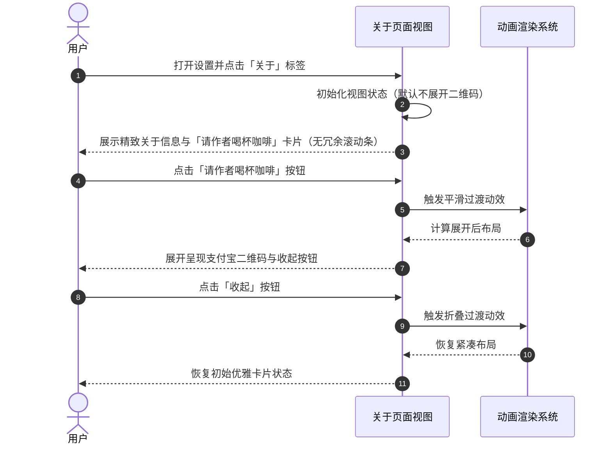

# 优化关于页面布局与打赏交互

## 概述
为了让您在浏览「关于」页面时拥有更加清爽、精致且舒适的视觉体验，我们将对关于页面的布局结构与打赏模块进行全面优化。首先，我们将消除内容未超出窗口时异常显现的纵向滚动条，让页面在默认状态下浑然一体、干净利落；其次，针对作者支持与打赏区域，我们将默认收起大面积的支付宝二维码，以精致的咖啡图标、温和诚恳的感言以及「请作者喝杯咖啡」按钮作为默认呈现，当您有心支持并点击按钮时，再平滑优雅地展开二维码。

## 测试用例
1. **纵向滚动条默认隐藏校验**：
   - 打开设置窗口，切换至「关于」标签页。
   - 观察整个关于页面的右侧区域，确认在窗口默认尺寸下不会出现多余的垂直滚动条轨道或滑块。
2. **打赏区域默认态校验**：
   - 观察关于页面下方的支持作者区域。
   - 确认默认不显示大幅支付宝二维码，而是呈现精致的咖啡图标、支持文案以及「请作者喝杯咖啡」交互按钮。
3. **展开与收起二维码交互校验**：
   - 点击「请作者喝杯咖啡」按钮，确认界面平滑展开显示支付宝二维码与「支付宝扫码」提示，同时按钮文字或状态更新为带有收起含义的提示（或提供收起按钮）。
   - 再次点击收起，确认二维码平滑隐藏，页面恢复紧凑优雅的默认状态。
   - 展开二维码后，若内容超出可视区域，测试上下滚动是否自然流畅。

## 方案
我们推荐对关于设置视图（AboutSettingsView）的层级排版与滚动策略进行精细化改造：
- 滚动条优化：移除固定高度造成的溢出限制，将关于页面的垂直滚动视图配置为根据内容自适应高度；或者在默认未展开二维码时使内容高度严格契合窗口可用高度，避免无意义的滚动条常驻。
- 打赏卡片交互设计：在关于页面中引入一个局部展开状态变量。未展开时，以卡片化容器居中呈现咖啡图标、感谢文案与胶囊风格的赞赏触发按钮；点击后通过 SwiftUI 平滑过渡动画展开支付宝二维码，并允许随时收起。

**优点**：
- 视觉观感大幅提升，默认状态紧凑精致，消除了无用滚动条带来的突兀感。
- 打赏引导更加含蓄温和，不喧宾夺主，给予使用者极佳的审美体验。
- 展开过程带有流畅的动画过渡，交互反馈自然顺畅。

**缺点**：
- 点击展开二维码后，页面高度会有所增加，此时若窗口较矮会触发正常滚动（这属于符合预期的按需滚动）。

