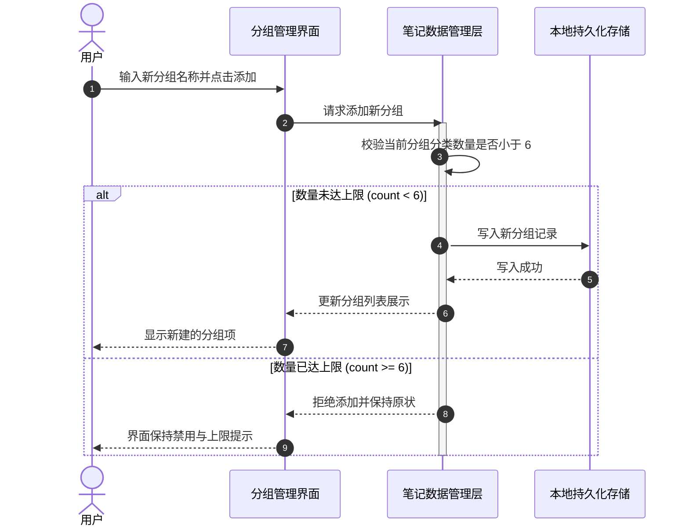

# 修改分组数量限制

## 概述
为了让您更灵活地分类整理灵感笔记与知识库内容，我们将普通笔记分组和知识库分组的最大允许创建数量由原先的 5 个放宽至 6 个。同时，为了保持主界面分组切换栏的整洁与美观，我们将单行最多排列数同步扩展为 6 个，并对分组标签的文字宽度进行合理约束（设置最大宽度限制，超出截断显示省略号），确保 6 个分组排布时不会挤压超出窗口宽度，带给您更加工整、舒畅的视觉与使用体验。

## 测试用例
1. **普通分组上限校验**：
   - 打开笔记面板，点击分组选择区域进入「管理分组」。
   - 在未满 6 个普通分组时，输入新分组名称并点击「添加」，确认能成功新建第 6 个分组。
   - 当普通分组达到 6 个时，确认输入框提示变为「分组数量已达上限(最多6个)」，添加按钮禁用，并显示上限说明文案。
2. **知识分组上限校验**：
   - 在管理分组弹窗中勾选「知识库分组」。
   - 同样测试添加知识分组，验证上限正确放宽至 6 个，且达到 6 个时正确拦截。
3. **主界面分组宽度与单行排版**：
   - 创建 6 个分组，其中包含较长名称的分组（如“项目资料管理归档”）。
   - 返回笔记主界面观察分组选择器，确认 6 个分组保持单行工整排列。
   - 确认长名称分组文字被合适的最大宽度限制并显示省略号（...），未发生换行或溢出窗口两边。

## 方案
我们推荐直接在数据层与视图交互层统一调整分组阈值常量并增加标签宽度限制：
- 将分组存储校验逻辑中的分组数量保护上限由 5 调整为 6。
- 将分组管理界面（GroupManagerView）中的上限判断逻辑、占位提示文案及警示文本统一同步为 6 个。
- 将主界面分组选择器（groupSelectorView）每行最多容纳数（maxPerRow）由 5 调整为 6。
- 在分组选择器中的分组文本上添加最大宽度约束（如限制在合适的最大宽度并配合截断），确保 6 个分组在 350px 宽度的笔记窗口内能完美排布。

**优点**：
- 改动精准集中，影响范围清晰可控。
- 界面提示与底层数据校验保持高度一致，防止绕过与数据不一致。
- 引入最大宽度截断保护，即使有长名称分组，6 个分组也能始终稳定居于单行内，排版规整美观。

**缺点**：
- 过长名称的分组在主界面展示时会被截断显示（但鼠标悬停或在管理弹窗中仍可查看完整名称）。

