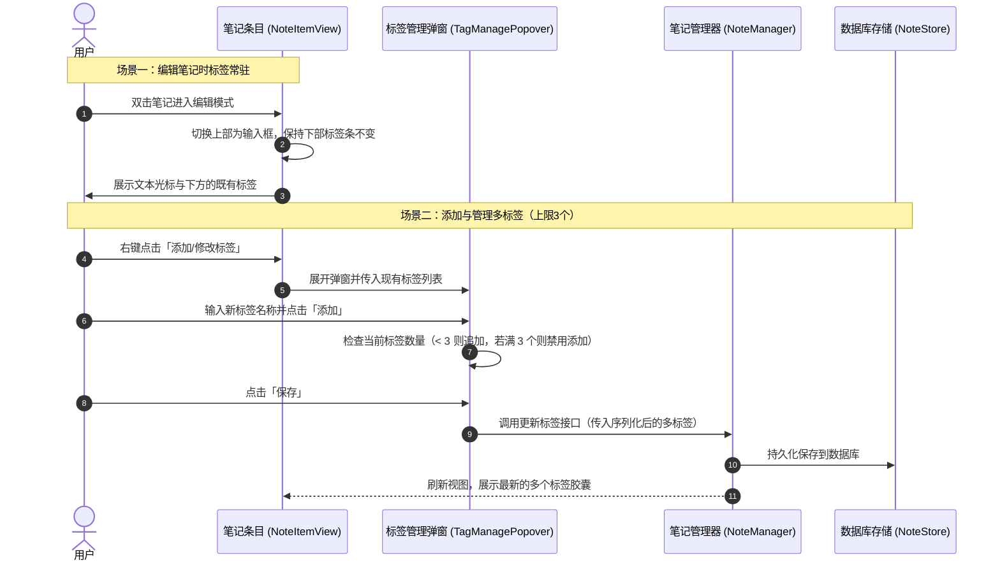

# 笔记编辑状态标签显示优化及多标签数量限制

## 概述
在笔记列表的日常使用中，用户在双击笔记进入行内编辑模式时，原有的布局逻辑会将下方的状态徽章区域（包括“记忆”标识、“进行中”任务状态以及“标签”）隐藏，导致用户在编辑文字时无法查看与对照当前笔记所属的标签；同时，原有的标签输入仅支持单个标签设定，无法满足为单条笔记归类多个标签（例如同时打上“工作”、“紧急”、“设计”）的诉求。

为了提升笔记的归类灵活性与编辑体验，我们计划进行两项优化：
1. **编辑状态标签始终可见**：重构笔记条目视图的层级结构，将状态徽章与标签栏从非编辑条件块中提升至外层，使得在行内编辑笔记内容时，如果有标签或状态徽章，依然始终优雅展示在输入框下方；
2. **多标签独立输入与数量限制**：将标签输入弹窗升级为独立标签管理模式，展示已有标签胶囊（附带便捷删除操作），提供输入框与“+添加标签”按钮，并严格限制单条笔记最多添加 3 个标签。底层通过通用分隔符（英文逗号）序列化存储，完美兼顾现有数据库架构与历史数据兼容。

## 测试用例
1. **编辑状态标签展示验证**：
   - 找到一条已打标签的笔记条目，双击进入行内编辑模式；
   - 观察笔记输入框下方：原有的标签徽章依然清晰展示，未被隐藏；
   - 修改笔记内容并保存（按回车或失焦），确认标签状态保持完好，内容正确更新；
   - 新建一条空笔记，进入编辑模式，确认无标签时下方区域不留多余空白。

2. **标签弹窗交互与多标签添加验证**：
   - 右键点击笔记选择「添加/修改标签」；
   - 观察弹窗界面：显示当前已有的标签列表（胶囊样式，右侧带有小叉号删除按钮）及添加区域；
   - 在输入框中输入新标签名，点击「+添加」或按下回车，新标签即时进入列表；
   - 点击已添加标签上的删除按钮，该标签被移除。

3. **最多 3 个标签上限限制验证**：
   - 连续添加 3 个标签后，观察添加区域：“+添加”按钮与输入框变为禁用状态，并友好提示“最多添加 3 个标签”；
   - 删除其中 1 个标签后，添加区域自动恢复可用状态；
   - 点击「保存」关闭弹窗，返回笔记列表，条目下方同时展示这 3 个标签胶囊。

4. **标签筛选与历史数据兼容性验证**：
   - 点击条目下方的任意一个标签胶囊，触发标签筛选，笔记列表能够正确筛选出包含该标签的条目；
   - 针对历史只包含单个标签的笔记，能够正常解析并支持继续追加至最多 3 个；
   - 清空所有标签并保存后，笔记条目恢复无标签状态。

## 方案
我们推荐采用“层级提升 + 胶囊列表管理 + 逗号兼容序列化”方案。

- **核心思路**：
  1. **界面层级重构**：
     - 在笔记条目视图中，将左侧垂直栈调整为两大部分：上部分根据编辑状态切换“多行输入框”或“只读文本”，下部分统一放置“徽章与标签胶囊条”；
     - 只要存在标签或状态标记，无论是否处于编辑中，下方的标签徽章均保持常驻展示。
  2. **多标签存储与管理**：
     - 单条笔记的标签字段底层使用英文逗号拼接存储，无需改动数据库表结构与外键，数据读写性能高且完全向后兼容；
     - 在业务模型层提供辅助属性/方法，方便将字符串切分为标签数组，并在更新时严格拦截超过 3 个标签的操作。
  3. **标签弹窗 UI 升级**：
     - 在弹窗中展示当前笔记的标签胶囊列表与单个删除按钮；
     - 提供输入框与添加按钮，动态判断当前数量是否达到 3 个上限，达到上限时给出直观引导并禁用添加。

- **优缺点分析**：
  - **优点**：
    - 无需升级或迁移 SQLite 数据表，对现有数据库零风险，向下无缝兼容单标签数据；
    - 编辑过程中始终能清晰感知笔记归类，体验直观连贯；
    - 独立标签输入清晰防呆，上限 3 个控制明确，有效防止长标签撑破列表卡片宽度。
  - **缺点**：
    - 标签中不允许使用逗号作为标签名本身的内容（可通过输入过滤自动清理逗号）。

- **时序图**：

