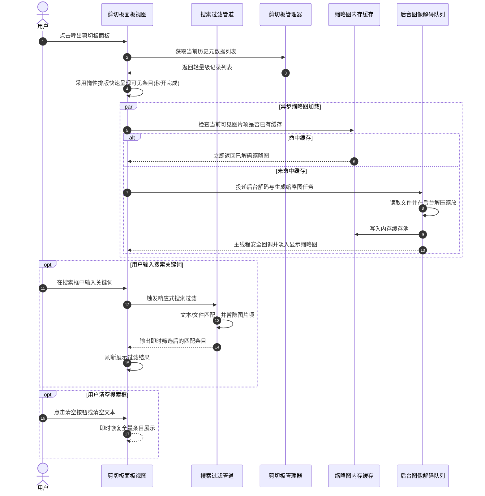

# 剪切板卡顿优化与搜索功能

## 概述

剪切板历史面板是我们日常高频呼出、查看与复用历史内容的重要工具。然而在当前的实现中，每当剪切板中积累了较多历史记录（尤其是多张高分辨率截图）时，面板在展开的瞬间就会出现明显的假死与掉帧现象，极大地影响了操作的敏捷性。同时，面对数十条历史条目，仅凭肉眼逐项翻找效率较低，迫切需要便捷的检索手段。

本次任务的核心目标是为剪切板带来流畅度与检索效率的双重提升：一方面通过全方位的架构轻量化与异步缓存机制，彻底解决面板打开时的卡死问题，恢复丝滑灵动的呼吸感；另一方面在面板头部增设优雅常驻的搜索框，让您能够随时随地快速键入关键词，即时筛选所需的文本与文件记录，让整个剪切板体验兼具极速响应与从容高效。

## 测试用例

为了确保本次优化与新特性的稳定交付，我们规划了以下完整的手动验证流程，请在更新完成后按照步骤体验与确认：

### 1. 剪切板面板秒开与多图顺畅浏览验证
- **准备工作**：在日常操作中连续复制多张全屏截图（包含高清 Retina 屏幕截图）以及多段长短不一的文本，使剪切板历史记录充盈（达到数十条）。
- **操作步骤**：点击悬浮球上的剪切板图标（或通过对应配置的快捷键）呼出剪切板面板。
- **预期结果**：面板瞬间弹出，无任何白屏、卡死或界面假死现象；用鼠标滚轮或触控板快速上下滑动列表，页面滑动顺畅无掉帧；鼠标在带有图片的条目之间来回悬浮（Hover）时，按钮浮现灵敏平滑，无二次卡顿。

### 2. 搜索框常驻展示与焦点状态验证
- **操作步骤**：打开剪切板面板，观察面板顶部区域。
- **预期结果**：在历史记录标题下方，清晰常驻一条紧凑美观的搜索输入框，内含搜索占位文字与放大镜图标；同时面板打开时鼠标与键盘焦点不会被强制抢占，直接滑动滚轮或点击其他按钮不受任何影响。

### 3. 关键词即时检索与结果过滤验证
- **操作步骤**：
  1. 点击搜索框，输入特定关键词（支持中英文字符、大小写混排）。
  2. 观察列表中展示的内容变化。
  3. 尝试输入某一个已复制文件的名称或路径片段。
- **预期结果**：
  1. 列表根据输入的关键词即时响应、毫秒级过滤，仅展示内容包含该关键词的文本记录。
  2. 搜索文件路径或文件名时，能精准命中并展示对应的文件条目。
  3. 当输入框有非空搜索词时，列表自动隐藏图片记录，避免视觉干扰。

### 4. 搜索框清空与全量恢复验证
- **操作步骤**：
  1. 在搜索状态下，点击搜索框右侧出现的一键清空图标（小叉号）。
  2. 或通过键盘退格键清空搜索框中的所有文本。
- **预期结果**：搜索框清空后，列表立即恢复展示包含图片在内的全部历史记录，条目排序与原来保持完全一致。

### 5. 过滤结果的复制与笔记归档验证
- **操作步骤**：在搜索筛选出的结果中，点击某一条文本右侧的复制按钮；或者点击保存到笔记按钮。
- **预期结果**：系统剪贴板成功写入该条目并弹出提示气泡，或顺利将内容存入便签库，基础操作链条完备无误。

## 方案

### 方案概述

本推荐方案紧密围绕「消除主线程负载」与「提升交互响应」两大轴心展开重构：

首先，在界面渲染层，我们将原有全量同步渲染的垂直容器重构为按需生成的惰性排版容器，仅测量并实例化屏幕可见区域内的卡片，从根本上阻断历史条目数量激增时的集中式算力峰值。针对图片解码这一造成卡死的头号元凶，构建专门的后台图像异步管道与内存缩略图缓存池。大图的解码与等比例缩放全部转移至后台线程进行，主线程仅在缓存命中后负责轻量级图像贴图，并在卡片多次重绘与悬浮交互时直接复用内存缩略图，彻底根除重复解码造成的掉帧。同时，梳理外层窗口自适应尺寸与内层滚动视图的嵌套关系，消解不必要的重复几何测算。

其次，在搜索能力构建上，我们在面板标题栏下方布局一条常驻紧凑的搜索栏，配以柔和半透明的背景风格与快速清空交互。搜索栏接入响应式过滤管道，在内存中对历史记录的文字摘要与文件路径进行即时判定。当搜索框有内容输入时，智能过滤掉无文字特征的图片项目，使目标结果高度聚焦；而当搜索词清空时，无缝平滑切回完整视图，保障用户最自然的视觉预期。

### 方案优缺点评估

- **优点**：
  - **彻底解除主线程拥堵**：无论是几十条还是上百条记录，无论包含多大分辨率的屏幕截图，面板均能在数毫秒内完成初次装载与弹出，告别假死卡顿。
  - **精细化内存与运算管理**：缩略图内存缓存避免了每次鼠标掠过触发视图重绘时的庞大计算损耗，大幅降低图形系统与 CPU 瞬时负荷。
  - **沉浸顺畅的搜索体验**：常驻搜索框即输即搜，搭配一键清空与智能非文本过滤，帮助用户在繁杂的复制历史中快速锁定关键信息。
  - **原生统一的视觉质感**：界面设计严谨遵循既有的深色磨砂与圆角美学，操作逻辑平滑自然，保持极低的用户认知与迁移成本。
- **缺点**：
  - **首屏大图渲染有微弱延时感**：由于图片移至后台异步解压缩，当首次快速滑至带有大图的条目时，缩略图会在后台处理完成后淡入显现（约几十毫秒），但此过程完全不占用主线程，不会产生任何操作冻结。

### 架构时序图

