# 智能提醒系统时序图文档

## 概述
本文档详细描述了 AIX 应用中智能提醒系统的完整工作流程，包括启动、工作计时、空闲检测、音频/视频模式、休息检测、用户交互、系统休眠唤醒等各个环节的时序关系。

## 系统组件

### 核心组件
- **SmartReminderManager**: 智能提醒管理器，负责整个提醒流程的协调
- **InputMonitor**: 输入监听器，监测键盘鼠标活动和系统锁定状态
- **AudioActivityMonitor**: 音频活动监测器，检测系统音频输出判断用户是否在看视频/听音乐
- **StatusBarTimerView**: 菜单栏计时显示视图
- **ReminderOverlayWindow**: 休息提醒蒙版窗口

### 配置组件
- **SmartReminderConfig**: 智能提醒配置
  - workDuration: 工作时长（默认45分钟）
  - restDuration: 休息时长（默认5分钟）
  - idleThreshold: 空闲阈值（默认60秒）
  - restRecognitionTime: 休息认定时间（默认270秒，即4分30秒）

## 完整流程时序图

### 1. 系统启动流程

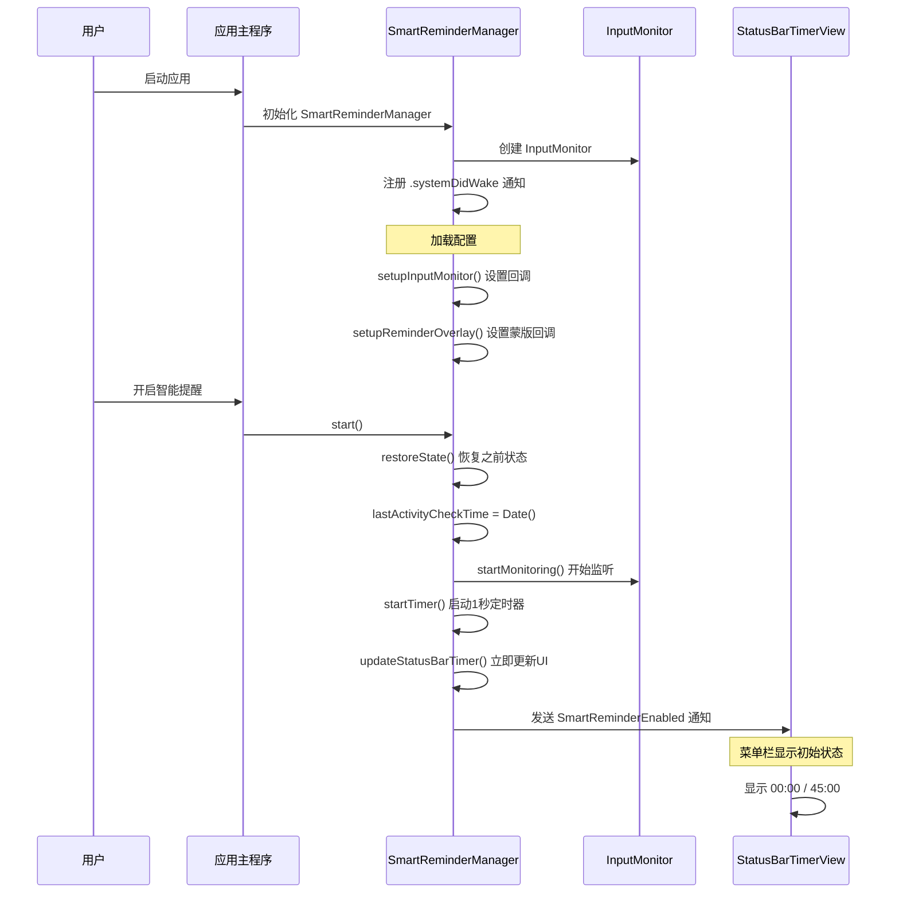

### 2. 正常工作计时流程（handleTimerTick 主循环）

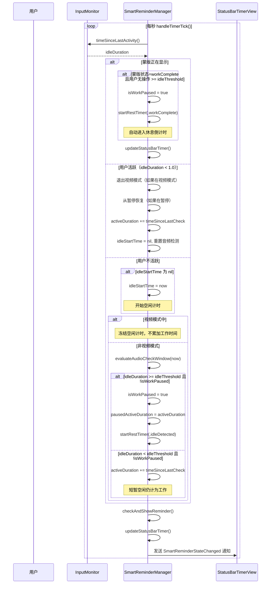

### 3. 音频检测与视频模式

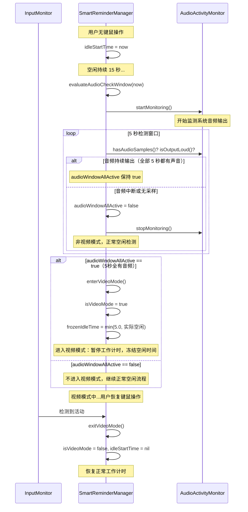

### 4. 达到工作时长触发提醒流程

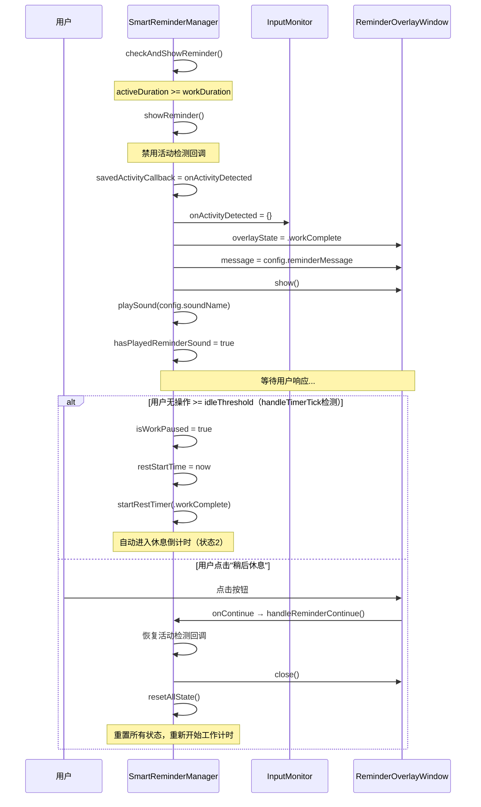

### 5. 空闲检测触发休息流程

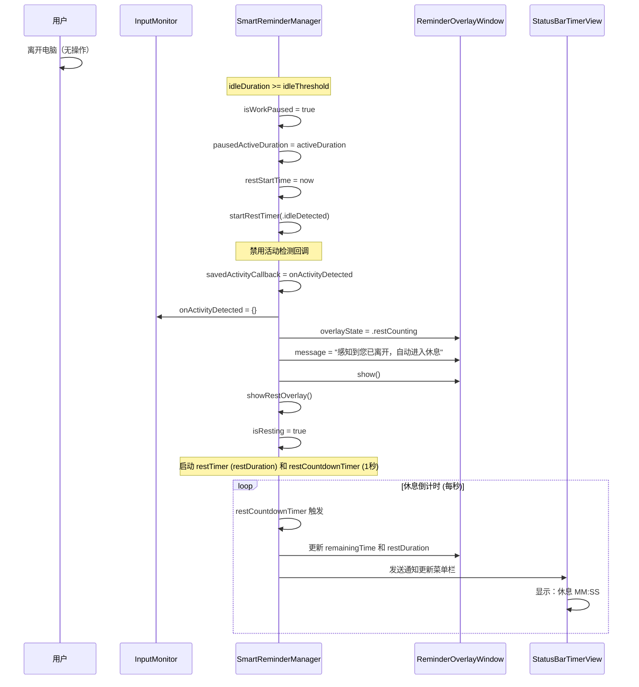

### 6. 休息中的各种场景

#### 6.1 用户提前返回（休息不足）

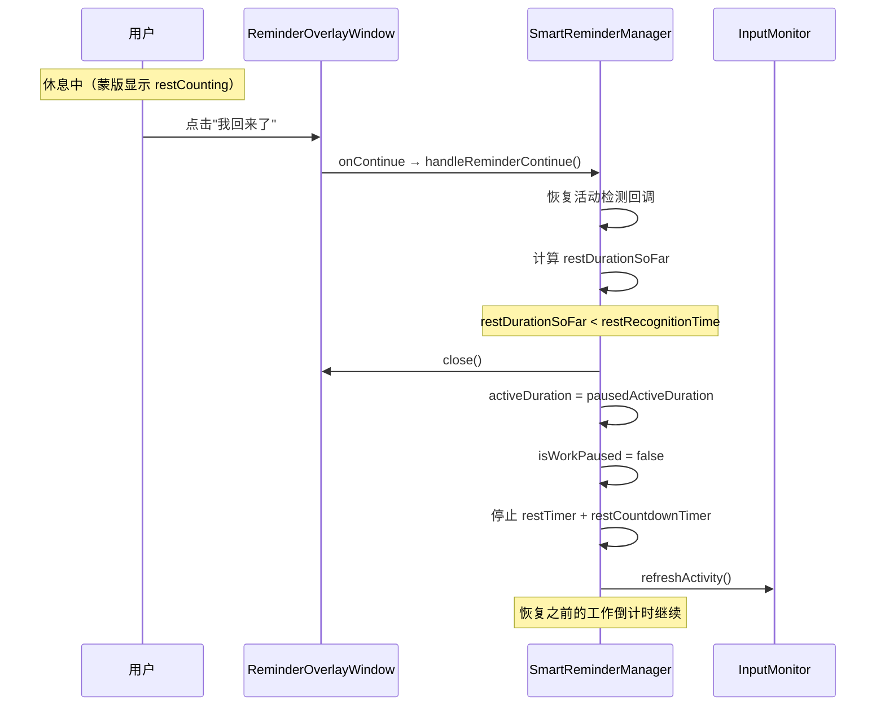

#### 6.2 用户充分休息返回

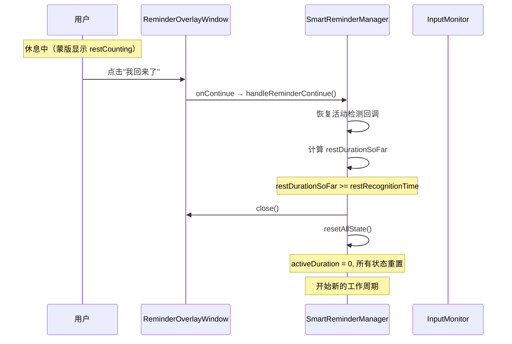

#### 6.3 休息倒计时结束

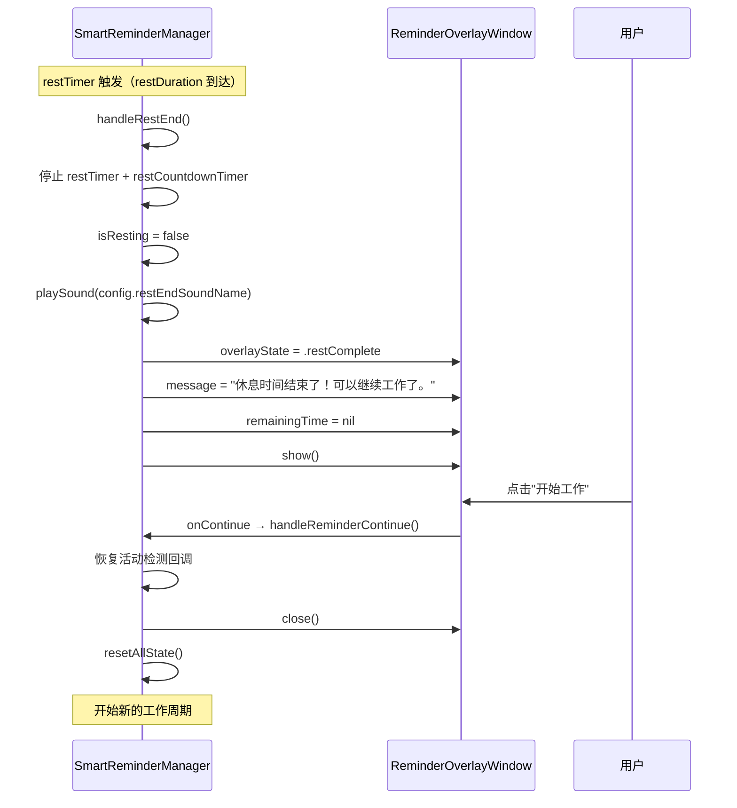

### 7. 用户从空闲/休息中回来（键鼠活动检测）

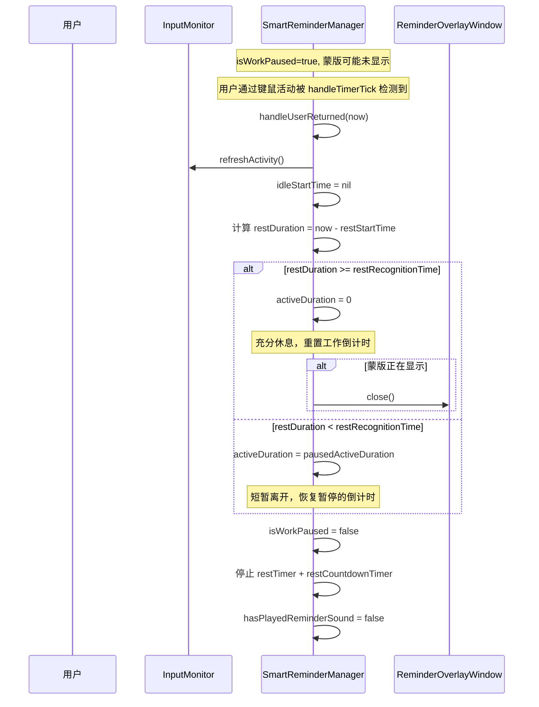

### 8. 系统锁屏/解锁处理

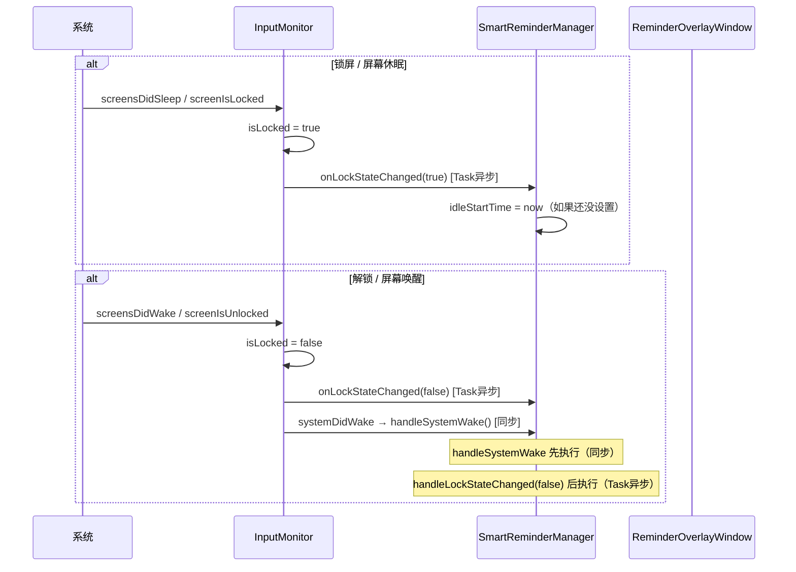

### 9. handleSystemWake 唤醒处理详细流程

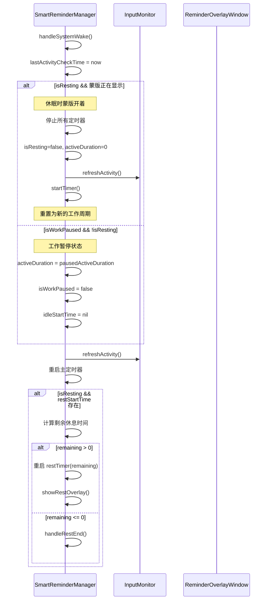

### 10. handleLockStateChanged 锁屏状态处理

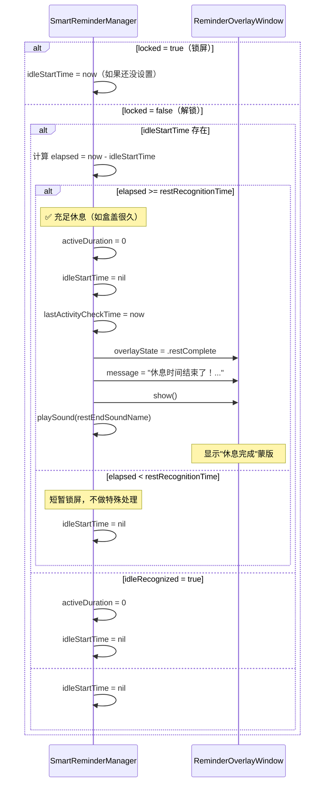

## 状态机图

### 提醒蒙版状态转换

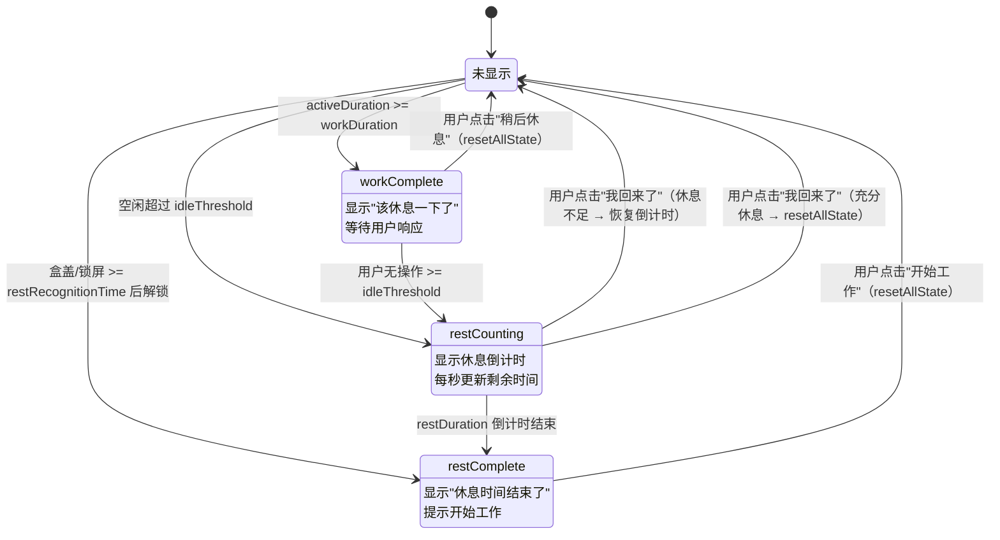

### 工作状态转换

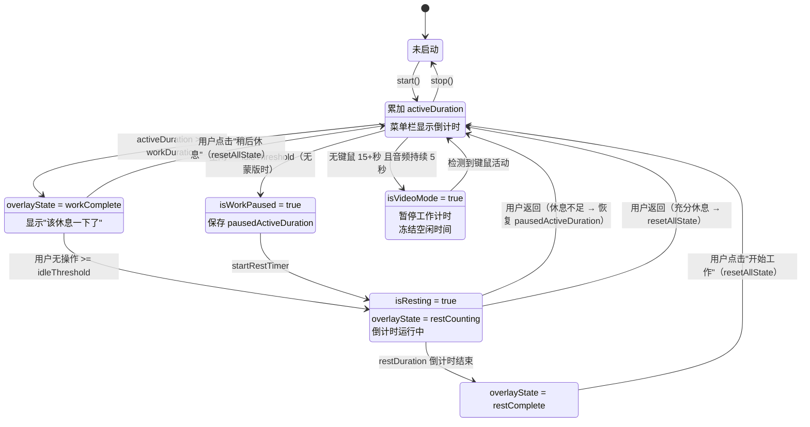

## 关键时间参数说明

| 参数 | 默认值 | 说明 | 可配置 |
|-----|--------|------|--------|
| workDuration | 2700秒（45分钟） | 工作时长，达到后触发休息提醒 | ✓ |
| restDuration | 300秒（5分钟） | 休息时长，倒计时结束后提示继续工作 | ✓ |
| idleThreshold | 60秒 | 空闲阈值，超过后认定为用户离开 | ✓ |
| restRecognitionTime | 270秒（4分30秒） | 休息认定时间，超过此时长认定为充分休息 | ✓ |
| Timer间隔 | 1.0秒 | 主定时器间隔，用于活动检测和时间累加 | ✗ |
| 音频检测启动延迟 | 15秒 | 空闲多久后才开始音频检测 | ✗ |
| 音频检测窗口 | 5秒 | 连续检测音频输出的窗口时间 | ✗ |

## 通知机制

### 发送的通知

| 通知名称 | 触发时机 | 携带数据 |
|---------|---------|---------|
| SmartReminderEnabled | 启动智能提醒时 | 无 |
| SmartReminderDisabled | 停止智能提醒时 | 无 |
| SmartReminderStateChanged | 每秒状态更新 | isResting, activeDuration, idleTime, workDuration, restDuration, restStartTime, hasPermission |

### 接收的通知

| 通知名称 | 来源 | 处理 |
|---------|------|------|
| .systemDidWake | InputMonitor (screensDidWake) | SmartReminderManager.handleSystemWake() |
| screensDidSleepNotification | NSWorkspace | InputMonitor → onLockStateChanged(true) |
| screensDidWakeNotification | NSWorkspace | InputMonitor → onLockStateChanged(false) + systemDidWake |
| com.apple.screenIsLocked | DistributedNotification | InputMonitor → onLockStateChanged(true) |
| com.apple.screenIsUnlocked | DistributedNotification | InputMonitor → onLockStateChanged(false) |

## 数据持久化

### 保存的状态

```json
{
    "activeDuration": "TimeInterval — 当前累计活跃时间",
    "isResting": "Bool — 是否在休息中",
    "restStartTime": "TimeInterval — 休息开始时间（Unix时间戳）"
}
```

### 保存时机
- 应用退出时（通过 AppDelegate）

### 恢复时机
- 应用启动时调用 start() → restoreState()

## 配置变更处理

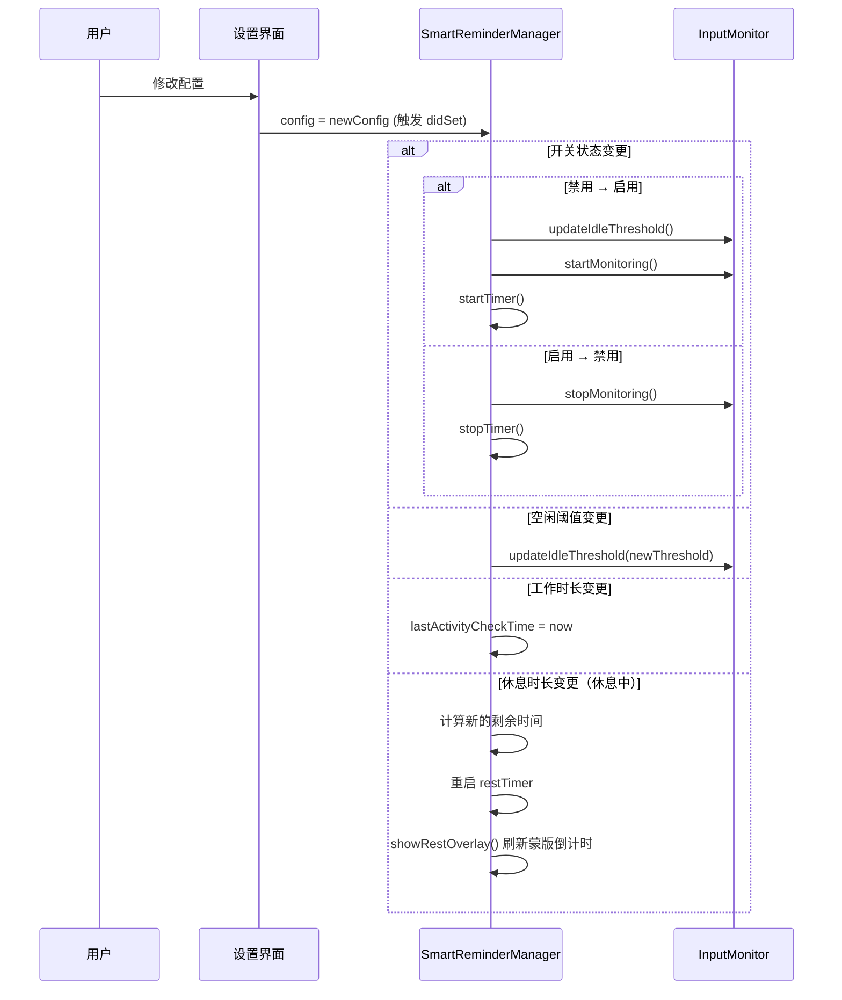

## 边界情况处理

### 1. 盒盖休眠后唤醒
- **场景**: 用户合上盖子很久后打开
- **处理**: `handleLockStateChanged(false)` 检测 elapsed >= restRecognitionTime → 显示"休息完成"蒙版 + 重置 activeDuration

### 2. 休眠时蒙版正在显示
- **场景**: 蒙版显示中用户合盖休眠
- **处理**: `handleSystemWake` 检测 isResting && isVisible → 直接重置为新工作周期

### 3. 时间跳跃
- **场景**: 系统时间变更或休眠后时间跳跃
- **处理**: 唤醒时更新 lastActivityCheckTime，使用相对时间计算

### 4. 权限缺失
- **场景**: 无辅助功能权限时无法监测键鼠输入
- **处理**: 菜单栏显示"未授权"，提供权限设置引导

### 5. 快速开关
- **场景**: 用户快速开关智能提醒
- **处理**: didSet 中完整停止/启动监听和定时器

### 6. 视频/音频模式
- **场景**: 用户离开键鼠但在看视频/听音乐
- **处理**: 空闲 15 秒后启动音频检测，连续 5 秒有音频输出 → 进入视频模式，暂停工作计时

### 7. 休息中配置修改
- **场景**: 休息中修改休息时长
- **处理**: 计算新的剩余时间，重启休息定时器，刷新蒙版显示

---

**文档版本**: 2.0  
**最后更新**: 2026-02-12  
**维护人员**: Xavier
