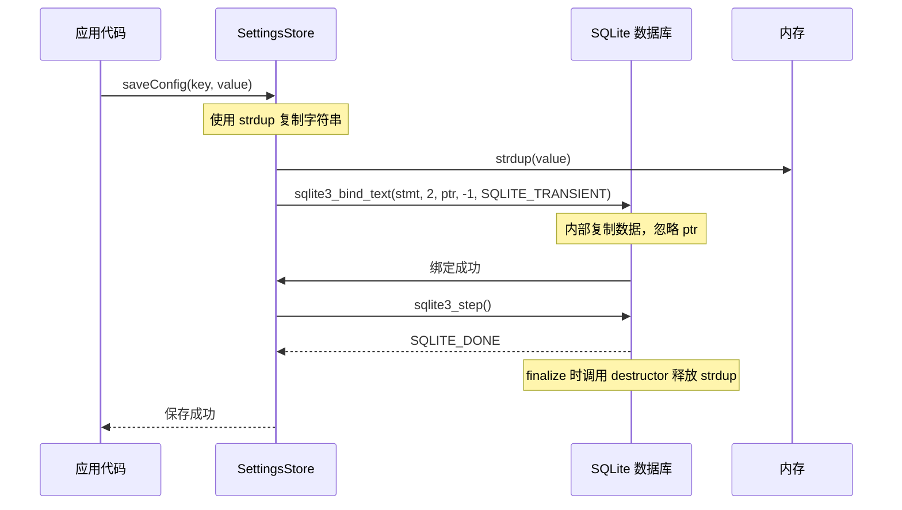

## Context

当前 `SettingsStore` 负责将应用配置（包括悬浮球颜色、大小等设置）保存到 SQLite 数据库。问题出在 SQLite C API 的绑定函数调用方式上，导致配置数据无法正确持久化。

### 问题分析

**saveConfig 问题：**
```swift
sqlite3_bind_text(statement, 1, key.utf8CString.withUnsafeBufferPointer { $0.baseAddress }, -1, nil)
sqlite3_bind_text(statement, 2, value.utf8CString.withUnsafeBufferPointer { $0.baseAddress }, -1, nil)
```

- 第4个参数 `destructor` 传递 `nil`，意味着 SQLite 不会复制字符串内容
- 而 `utf8CString` 是临时创建的，在语句执行后可能被释放
- 导致数据库中存储的是悬空指针或空数据

**loadConfig 问题：**
```swift
sqlite3_bind_text(statement, 1, key.utf8CString.withUnsafeBufferPointer { $0.baseAddress }, -1, nil)
```

- 同样的 `withUnsafeBufferPointer` 问题，闭包执行完后指针失效
- 绑定到查询中的 key 可能变成无效指针

## 关键设计流程图展现

```mermaid
flowchart TD
    subgraph 修复前[saveConfig 问题流程]
        A1[调用 saveConfig] --> B1[创建 utf8CString]
        B1 --> C1[withUnsafeBufferPointer 获取指针]
        C1 --> D1[sqlite3_bind_text 绑定<br/>destructor=nil]
        D1 --> E1[SQLite 记录指针地址<br/>不复制数据]
        E1 --> F1[utf8CString 内存释放]
        F1 --> G1[数据库中的指针变为悬空指针]
        G1 --> H1[配置读取失败或数据损坏]
    end

    subgraph 修复后[正确保存流程]
        A2[调用 saveConfig] --> B2[strdup 复制字符串]
        B2 --> C2[sqlite3_bind_text 绑定<br/>destructor=SQLITE_TRANSIENT]
        C2 --> D2[SQLite 内部复制数据]
        D2 --> E2[sqlite3_step 执行语句]
        E2 --> F2[sqlite3_finalize 自动调用 destructor<br/>释放 strdup 内存]
        F2 --> G2[数据库中存储正确数据]
    end

    style A1 fill:#ffcccc
    style G1 fill:#ffcccc
    style A2 fill:#ccffcc
    style G2 fill:#ccffcc
```





## Goals / Non-Goals

**Goals:**
- 修复 `SettingsStore.saveConfig` 使配置正确保存到数据库
- 修复 `SettingsStore.loadConfig` 使配置能正确从数据库读取
- 确保悬浮球颜色、大小等个性化设置在软件重启后正确恢复
- 保持向后兼容性，不改变数据库表结构

**Non-Goals:**
- 不重构整个数据访问层
- 不添加新的数据库表或迁移
- 不改变 `FloatingButtonConfig` 的数据结构或序列化格式
- 不添加单元测试（后续可在 tasks 中添加）

## Decisions

### 决策 1：使用 `SQLITE_TRANSIENT` 而非 `nil`

**选项：**
- `nil`: SQLite 不复制字符串，使用传入的指针
- `SQLITE_TRANSIENT`: SQLite 立即复制字符串到内部缓冲区

**选择：** `SQLITE_TRANSIENT`

**理由：**
- 更安全，不需要开发者管理字符串生命周期
- SQLite 会自动处理内存管理
- 避免悬空指针问题

### 决策 2：字符串复制策略

**选项：**
- 使用 `strdup` + 手动 `free`
- 使用 `SQLITE_TRANSIENT` 让 SQLite 内部复制

**选择：** `SQLITE_TRANSIENT`

**理由：**
- 代码更简洁
- 内存管理由 SQLite 统一处理
- 避免手动管理内存可能带来的泄漏

### 决策 3：读取时的指针处理

**问题：** `withUnsafeBufferPointer` 在闭包结束后指针失效

**解决方案：** 直接使用 `key.cString(using: .utf8)` 或 `key.utf8CString`

**理由：**
- 确保指针在 SQLite 执行期间有效
- SQLite 在 `sqlite3_step` 完成前不会释放参数

## Risks / Trade-offs

| 风险 | 可能性 | 影响 | 缓解措施 |
|------|--------|------|----------|
| 已有数据库数据损坏 | 低 | 用户需要重置设置 | 添加配置版本检查，必要时回退到默认值 |
| 修复后首次启动读取旧数据 | 中 | 配置恢复失败 | 在解码失败时捕获异常，返回默认值 |
| SQLite 版本兼容性问题 | 极低 | `SQLITE_TRANSIENT` 不可用 | 检查 SQLite 版本，大部分现代版本都支持 |

### 代码修改点

```swift
// saveConfig 修改
sqlite3_bind_text(statement, 1, key.utf8CString.withUnsafeBufferPointer { $0.baseAddress }, -1, SQLITE_TRANSIENT)
sqlite3_bind_text(statement, 2, value.utf8CString.withUnsafeBufferPointer { $0.baseAddress }, -1, SQLITE_TRANSIENT)
```

```swift
// loadConfig 修改  
sqlite3_bind_text(statement, 1, key.utf8CString.withUnsafeBufferPointer { $0.baseAddress }, -1, SQLITE_TRANSIENT)
```

需要添加导入或常量定义 `SQLITE_TRANSIENT`（值为 `-3`），因为 Swift 标准库不直接提供此常量。
