## 修改前后对比流程图

```mermaid
flowchart TD
    subgraph 修改前[问题：配置不持久化]
        A1[App 启动] --> B1[loadConfig 从数据库读取]
        B1 --> C1{数据库中有配置?}
        C1 -->|否| D1[使用默认配置]
        C1 -->|是| E1[返回配置 JSON]
        D1 --> F1[悬浮球显示默认颜色和大小]
        E1 --> G1[配置加载失败或数据损坏]
        G1 --> F1
        F1 --> H1[用户设置颜色/大小]
        H1 --> I1[saveConfig 保存到数据库]
        I1 --> J1{保存成功?}
        J1 -->|否| K1[配置丢失]
        J1 -->|是| L1[软件关闭]
        L1 --> A1
    end

    subgraph 修改后[修复后：配置正确持久化]
        A2[App 启动] --> B2[loadConfig 从数据库读取]
        B2 --> C2{数据库中有配置?}
        C2 -->|否| D2[使用默认配置]
        C2 -->|是| E2[正确解码配置]
        D2 --> F2[悬浮球显示用户上次设置]
        E2 --> F2
        F2 --> G2[用户设置颜色/大小]
        G2 --> H2[saveConfig 保存到数据库]
        H2 --> I2{保存成功?}
        I2 -->|是| J2[软件关闭]
        I2 -->|否| K2[记录错误]
        J2 --> L2[App 下次启动]
        L2 --> B2
    end

    style A1 fill:#ffcccc
    style F1 fill:#ffcccc
    style A2 fill:#ccffcc
    style F2 fill:#ccffcc
```

## Why

悬浮球的颜色和大小等个性化设置在软件重启后丢失，恢复为默认状态。这是因为 `SettingsStore.saveConfig` 和 `loadConfig` 中的 SQLite 绑定存在内存管理问题，导致配置无法正确保存和加载。

## What Changes

- 修复 `SettingsStore.saveConfig` 中 `sqlite3_bind_text` 的 destructor 参数问题
- 修复 `SettingsStore.loadConfig` 中 `sqlite3_bind_text` 的指针生命周期问题
- 验证 `FloatingButtonConfig` 的编解码逻辑正确工作

## Capabilities

### New Capabilities
- `floating-button-persistence`: 确保悬浮球配置（颜色、大小等）能在软件重启后正确恢复

### Modified Capabilities
- 无（这是修复现有功能的 bug，不涉及需求变更）

## Impact

- **修改文件**: `Sources/Model/SettingsStore.swift`
- **依赖组件**: `FloatingButtonConfigManager`（使用 SettingsStore 保存/加载配置）
- **数据库**: `AppConfig` 表结构不变，但需要验证数据完整性
